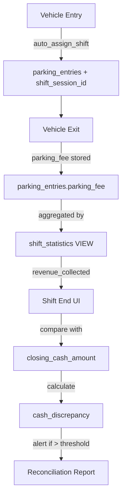
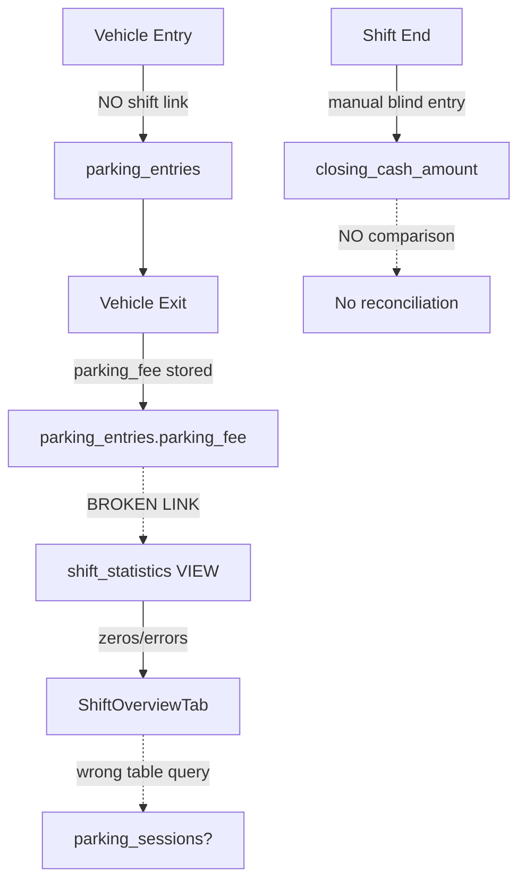

# Cash Collection & Revenue Integration - Ultra-Deep Analysis

## Executive Summary

**Critical Finding**: The parking management system has a **complete disconnection** between revenue generation (parking fees collected) and shift cash tracking (cash counted at shift end). The database architecture for integration exists but is **not deployed**, and UI components have **critical bugs** preventing reconciliation.

**Business Impact**:
- ❌ Operators count cash with zero awareness of expected revenue
- ❌ Impossible to detect theft, errors, or cash discrepancies
- ❌ Revenue reporting shows incorrect/zero values
- ❌ No automated cash reconciliation workflow

**Root Cause**: Migration file `005_parking_shift_integration.sql` contains complete integration logic but has **never been deployed** to production database.

---

## 1. Current Revenue & Cash Flow Architecture

### 1.1 Revenue Generation Flow (Parking Fees)

**Vehicle Exit Process** (`VehicleExitForm.tsx` → `parkingEntryService.ts`):

```typescript
// User exits vehicle
processExit({
  entryId: foundEntry.id,
  actualFee: amountNumber,        // Amount actually collected
  paymentType: paymentType,        // Cash/Digital/UPI
  exitNotes: notes
})

// Updates parking_entries table
UPDATE parking_entries SET
  exit_time = NOW(),
  status = 'Exited',
  payment_status = 'Paid',
  parking_fee = actualFee,         // ✅ Revenue stored here
  payment_type = paymentType
WHERE id = entryId
```

**Key Points**:
- ✅ Individual parking fees stored in `parking_entries.parking_fee`
- ✅ Payment type tracked (Cash/Digital separation possible)
- ✅ Payment status tracked (Paid/Unpaid/Partial)
- ❌ **NO connection to shift_sessions table** - shift_session_id column missing

### 1.2 Shift Cash Tracking Flow

**Shift Start** (`ShiftOperationsTab.tsx`):
```typescript
INSERT INTO shift_sessions (
  employee_id,
  employee_name,
  shift_start_time,
  opening_cash_amount,  // ✅ Manual entry - suggested from last shift
  shift_notes,
  status: 'active'
)
```

**Shift End** (`ShiftOperationsTab.tsx` lines 151-192):
```typescript
UPDATE shift_sessions SET
  shift_end_time = NOW(),
  closing_cash_amount = endingCash,  // ❌ BLIND MANUAL ENTRY
  status = 'completed',
  shift_notes = notes
WHERE id = activeShiftId
```

**Critical Gap**:
- Operator manually enters `closing_cash_amount`
- ❌ **NO display of calculated revenue** from parking fees
- ❌ **NO comparison** between expected revenue and counted cash
- ❌ **NO discrepancy alerts** or reconciliation workflow

### 1.3 Designed Integration (NOT Deployed)

**Migration File**: `database/migrations/005_parking_shift_integration.sql`

**Database Schema Addition**:
```sql
-- Add shift tracking to parking entries
ALTER TABLE parking_entries
ADD COLUMN IF NOT EXISTS shift_session_id UUID REFERENCES shift_sessions(id);

-- Auto-assign active shift trigger
CREATE TRIGGER auto_assign_shift_trigger
  BEFORE INSERT ON parking_entries
  FOR EACH ROW
  EXECUTE FUNCTION auto_assign_active_shift();
```

**Revenue Calculation View**:
```sql
CREATE VIEW shift_statistics AS
SELECT
  ss.id as shift_id,
  ss.opening_cash_amount,
  ss.closing_cash_amount,

  -- Revenue from parking fees
  COALESCE(SUM(pe.parking_fee) FILTER (
    WHERE pe.payment_status = 'Paid'
    AND pe.shift_session_id = ss.id
  ), 0) as revenue_collected,  -- ✅ Correct calculation

  -- Cash discrepancy calculation
  ss.cash_discrepancy,

  -- Payment breakdown
  COUNT(*) FILTER (WHERE pe.payment_type = 'Cash') as cash_transactions,
  COUNT(*) FILTER (WHERE pe.payment_type = 'Digital') as digital_transactions

FROM shift_sessions ss
LEFT JOIN parking_entries pe ON pe.shift_session_id = ss.id
GROUP BY ss.id
```

**Report Generation Function**:
```sql
CREATE FUNCTION generate_shift_report(p_shift_id UUID)
RETURNS JSONB
AS $$
  -- Returns comprehensive report with:
  -- - parking_statistics: vehicles entered/exited
  -- - financial_summary: revenue vs cash comparison
  -- - performance_metrics: revenue per hour, efficiency
  -- - detailed_entries: all parking transactions
$$;
```

**Status**: ❌ **NOT DEPLOYED** - These features don't exist in production database

---

## 2. Critical Bugs Discovered

### 2.1 ShiftOverviewTab - Wrong Table Query

**Location**: `web-app/src/components/shift/ShiftOverviewTab.tsx` lines 74-83

**Current Code**:
```typescript
const { data: parkingSessions, error } = await supabase
  .from('parking_sessions')  // ❌ WRONG TABLE - doesn't exist
  .select('*')
  .gte('entry_time', today.toISOString())

const totalRevenue = parkingSessions?.reduce((sum, session) => {
  return sum + (session.parking_fee || 0)  // Always returns 0 or errors
}, 0) || 0
```

**Problem**:
- Queries non-existent `parking_sessions` table
- Should query `parking_entries` table
- Results in zero revenue display or errors

**Impact**:
- ❌ "Today's Performance" shows incorrect revenue (likely $0.00)
- ❌ Vehicle counts may be wrong
- ❌ Operators have no visibility into shift revenue

### 2.2 Missing Reconciliation UI

**Location**: `web-app/src/components/shift/ShiftOperationsTab.tsx` lines 330-366

**Current Shift End Form**:
```typescript
<div>
  <label>Ending Cash Amount *</label>
  <input
    type="number"
    value={endShiftData.endingCash}
    onChange={(e) => setEndShiftData({
      ...prev,
      endingCash: parseFloat(e.target.value) || 0
    })}
    placeholder="0.00"
  />
</div>
```

**Missing Features**:
- ❌ NO display of calculated revenue from parking fees
- ❌ NO expected closing cash calculation (opening + revenue)
- ❌ NO discrepancy warning if entered amount doesn't match
- ❌ NO payment type breakdown (cash vs digital)

**What Should Be There**:
```typescript
// Expected Revenue Display
<div className="bg-blue-50 p-4 rounded-lg mb-4">
  <p className="text-sm text-gray-600">Expected Revenue (from parking fees)</p>
  <p className="text-2xl font-bold text-blue-600">
    {formatCurrency(calculatedRevenue)}
  </p>

  <div className="mt-2 text-sm">
    <p>Cash Payments: {formatCurrency(cashRevenue)}</p>
    <p>Digital Payments: {formatCurrency(digitalRevenue)}</p>
  </div>
</div>

// Expected Closing Cash
<div className="bg-green-50 p-4 rounded-lg mb-4">
  <p className="text-sm text-gray-600">Expected Closing Cash</p>
  <p className="text-xl font-bold text-green-600">
    {formatCurrency(openingCash + cashRevenue)}
  </p>
  <p className="text-xs text-gray-500">
    Opening: {formatCurrency(openingCash)} + Cash Revenue: {formatCurrency(cashRevenue)}
  </p>
</div>

// Discrepancy Alert
{Math.abs(enteredCash - expectedClosingCash) > 100 && (
  <Alert variant="warning">
    ⚠️ Cash Discrepancy: {formatCurrency(discrepancy)}
    {discrepancy > 0 ? ' EXCESS' : ' SHORTAGE'}
  </Alert>
)}
```

### 2.3 Database Schema State

**Confirmed Deployment Status**:
- ✅ Base schema deployed: `parking_entries`, `shift_sessions` tables exist
- ❌ Integration NOT deployed: `shift_session_id` column missing from parking_entries
- ❌ Triggers NOT deployed: Auto-assignment trigger doesn't exist
- ❌ Views NOT deployed: `shift_statistics` using placeholder zeros instead of real data

**Evidence**:
- Migration file `005_parking_shift_integration.sql` exists with complete logic
- Code references `shift_session_id` but column doesn't exist in production
- `shift_statistics` view from `001_create_shift_management_schema.sql` has hardcoded zeros for revenue

---

## 3. Revenue-to-Cash Flow Analysis

### 3.1 Designed Flow (When Properly Integrated)



**Key Integration Points**:
1. **Entry Linking**: New parking entry → auto-assigned to active shift
2. **Revenue Tracking**: Exit payment → parking_fee stored with shift_session_id
3. **Aggregation**: shift_statistics VIEW sums revenue by shift
4. **Reconciliation**: Shift end compares revenue vs counted cash
5. **Reporting**: Discrepancies flagged for investigation

### 3.2 Current Broken Flow



**Broken Links**:
1. ❌ parking_entries → shift_sessions: No shift_session_id column
2. ❌ shift_statistics → revenue: Returns placeholder zeros
3. ❌ UI → database: Queries wrong table (parking_sessions)
4. ❌ Shift end → revenue: No comparison or alerts

### 3.3 Revenue Calculation Logic

**From Migration File** (`005_parking_shift_integration.sql` lines 100-108):

```sql
-- Correct revenue calculation (NOT deployed)
revenue_collected = COALESCE(
  SUM(parking_entries.parking_fee)
  WHERE payment_status = 'Paid'
    AND shift_session_id = current_shift_id
, 0)

-- Should also break down by payment type
cash_revenue = SUM(parking_fee) WHERE payment_type = 'Cash' AND payment_status = 'Paid'
digital_revenue = SUM(parking_fee) WHERE payment_type IN ('Digital', 'UPI', 'Card') AND payment_status = 'Paid'
```

**Cash Reconciliation Formula**:
```
Expected_Closing_Cash = opening_cash_amount + cash_revenue
Cash_Discrepancy = closing_cash_amount - Expected_Closing_Cash

Acceptable Range: -100 to +100 (configurable threshold)
Alert if: ABS(Cash_Discrepancy) > threshold
```

---

## 4. Business Impact Analysis

### 4.1 Current Problems

**Financial Control**:
- ❌ **No theft detection**: Operators can pocket cash without detection
- ❌ **No error detection**: Calculation errors, wrong change given - undetectable
- ❌ **No audit trail**: Cash vs revenue comparison impossible
- ❌ **Revenue leakage**: Unpaid exits, manual overrides not tracked

**Operational Issues**:
- ❌ **Blind cash counting**: Operators don't know expected amount
- ❌ **No shift accountability**: Can't tie revenue to specific operators
- ❌ **Broken reporting**: Revenue reports show zero or incorrect values
- ❌ **Management blind**: No real-time revenue visibility

### 4.2 Financial Risk Assessment

**Daily Revenue Assumptions**: ₹50,000 average daily parking revenue

**Potential Losses**:
- 5% cash handling errors = ₹2,500/day = ₹75,000/month
- 2% theft/fraud = ₹1,000/day = ₹30,000/month
- 3% accounting errors = ₹1,500/day = ₹45,000/month

**Total Potential Loss**: ₹150,000/month without proper reconciliation

**Risk Multipliers**:
- Multiple shift operators = higher variance
- No audit trail = impossible to identify source
- Manual processes = human error prone

### 4.3 Compliance & Audit Issues

**Tax Compliance**:
- ❌ Revenue records incomplete (missing shift links)
- ❌ Cash vs digital tracking not automated
- ❌ Audit trail gaps (can't prove revenue source)

**Internal Audit**:
- ❌ No reconciliation evidence
- ❌ Manual processes not verifiable
- ❌ Discrepancy investigation impossible

---

## 5. Complete Solution Roadmap

### Phase 1: Database Integration (CRITICAL - Deploy First)

**Deploy Migration**: `database/migrations/005_parking_shift_integration.sql`

```bash
# Execute in Supabase SQL Editor
# File: 005_parking_shift_integration.sql
# Contains:
# 1. ALTER TABLE parking_entries ADD shift_session_id
# 2. CREATE TRIGGER auto_assign_active_shift()
# 3. UPDATE shift_statistics VIEW with real revenue
# 4. CREATE FUNCTION generate_shift_report()
# 5. Add RLS policies for shift-based access
```

**Verification Queries**:
```sql
-- 1. Check shift_session_id column exists
SELECT column_name, data_type
FROM information_schema.columns
WHERE table_name = 'parking_entries'
AND column_name = 'shift_session_id';

-- 2. Verify trigger exists
SELECT trigger_name, event_manipulation, event_object_table
FROM information_schema.triggers
WHERE trigger_name = 'auto_assign_shift_trigger';

-- 3. Test shift_statistics view
SELECT shift_id, revenue_collected, vehicles_entered, vehicles_exited
FROM shift_statistics
WHERE status = 'active'
LIMIT 1;

-- 4. Verify auto-assignment working
INSERT INTO parking_entries (...) VALUES (...);
SELECT shift_session_id FROM parking_entries ORDER BY created_at DESC LIMIT 1;
-- Should return active shift ID, not NULL
```

### Phase 2: Fix UI Components (HIGH Priority)

#### 2.1 Fix ShiftOverviewTab Revenue Display

**File**: `web-app/src/components/shift/ShiftOverviewTab.tsx`

**Current (Broken)**:
```typescript
// Lines 74-83 - WRONG TABLE
const { data: parkingSessions } = await supabase
  .from('parking_sessions')  // ❌
  .select('*')
```

**Fixed**:
```typescript
// Use shift_statistics view for accurate data
const fetchActiveShiftStats = async () => {
  if (!linkingState.activeShiftId) return

  const { data: stats, error } = await supabase
    .from('shift_statistics')
    .select('*')
    .eq('shift_id', linkingState.activeShiftId)
    .single()

  if (error) {
    console.error('Error fetching shift stats:', error)
    return
  }

  setTodayStats({
    totalRevenue: stats.revenue_collected || 0,
    vehiclesProcessed: stats.vehicles_entered || 0,
    currentlyParked: stats.vehicles_currently_parked || 0,
    averageSessionTime: stats.average_stay_duration_hours || 0
  })
}
```

#### 2.2 Add Reconciliation to Shift End

**File**: `web-app/src/components/shift/ShiftOperationsTab.tsx`

**New Component**: `ShiftEndReconciliation.tsx`

```typescript
import React, { useEffect, useState } from 'react'
import { supabase } from '../../lib/supabase'
import { formatCurrency } from '../../utils/helpers'

interface ReconciliationData {
  openingCash: number
  revenue_collected: number
  cash_revenue: number
  digital_revenue: number
  expected_closing_cash: number
  vehicles_processed: number
}

interface Props {
  shiftId: string
  enteredClosingCash: number
  onDiscrepancyDetected: (amount: number) => void
}

export const ShiftEndReconciliation: React.FC<Props> = ({
  shiftId,
  enteredClosingCash,
  onDiscrepancyDetected
}) => {
  const [recon, setRecon] = useState<ReconciliationData | null>(null)
  const [loading, setLoading] = useState(true)

  useEffect(() => {
    fetchReconciliation()
  }, [shiftId])

  const fetchReconciliation = async () => {
    try {
      // Get shift statistics
      const { data: stats, error } = await supabase
        .from('shift_statistics')
        .select('*')
        .eq('shift_id', shiftId)
        .single()

      if (error) throw error

      // Get payment type breakdown
      const { data: breakdown } = await supabase
        .rpc('get_shift_revenue_breakdown', { p_shift_id: shiftId })

      const cashRevenue = breakdown?.revenue_by_payment_type?.Cash || 0
      const digitalRevenue = (stats.revenue_collected || 0) - cashRevenue

      const reconData = {
        openingCash: stats.opening_cash_amount || 0,
        revenue_collected: stats.revenue_collected || 0,
        cash_revenue: cashRevenue,
        digital_revenue: digitalRevenue,
        expected_closing_cash: (stats.opening_cash_amount || 0) + cashRevenue,
        vehicles_processed: stats.vehicles_entered || 0
      }

      setRecon(reconData)

      // Check for discrepancy
      const discrepancy = enteredClosingCash - reconData.expected_closing_cash
      if (Math.abs(discrepancy) > 0.01) {
        onDiscrepancyDetected(discrepancy)
      }

    } catch (error) {
      console.error('Reconciliation error:', error)
    } finally {
      setLoading(false)
    }
  }

  if (loading) return <div>Loading reconciliation...</div>
  if (!recon) return null

  const discrepancy = enteredClosingCash - recon.expected_closing_cash
  const hasDiscrepancy = Math.abs(discrepancy) > 100 // ₹100 threshold

  return (
    <div className="space-y-4 mb-6">
      {/* Revenue Summary */}
      <div className="bg-blue-50 border border-blue-200 rounded-lg p-4">
        <h4 className="font-semibold text-blue-900 mb-3">Revenue Summary</h4>
        <div className="grid grid-cols-2 gap-3 text-sm">
          <div>
            <p className="text-gray-600">Cash Payments</p>
            <p className="text-lg font-bold text-blue-900">
              {formatCurrency(recon.cash_revenue)}
            </p>
          </div>
          <div>
            <p className="text-gray-600">Digital Payments</p>
            <p className="text-lg font-bold text-blue-900">
              {formatCurrency(recon.digital_revenue)}
            </p>
          </div>
          <div className="col-span-2 border-t border-blue-200 pt-2 mt-2">
            <p className="text-gray-600">Total Revenue Collected</p>
            <p className="text-xl font-bold text-blue-900">
              {formatCurrency(recon.revenue_collected)}
            </p>
            <p className="text-xs text-gray-500 mt-1">
              {recon.vehicles_processed} vehicles processed
            </p>
          </div>
        </div>
      </div>

      {/* Cash Reconciliation */}
      <div className="bg-green-50 border border-green-200 rounded-lg p-4">
        <h4 className="font-semibold text-green-900 mb-3">Cash Reconciliation</h4>
        <div className="space-y-2 text-sm">
          <div className="flex justify-between">
            <span className="text-gray-600">Opening Cash</span>
            <span className="font-semibold">{formatCurrency(recon.openingCash)}</span>
          </div>
          <div className="flex justify-between">
            <span className="text-gray-600">+ Cash Revenue</span>
            <span className="font-semibold text-green-600">
              {formatCurrency(recon.cash_revenue)}
            </span>
          </div>
          <div className="flex justify-between border-t border-green-300 pt-2">
            <span className="font-semibold text-gray-900">Expected Closing Cash</span>
            <span className="text-lg font-bold text-green-900">
              {formatCurrency(recon.expected_closing_cash)}
            </span>
          </div>
        </div>
      </div>

      {/* Discrepancy Alert */}
      {hasDiscrepancy && (
        <div className={`border rounded-lg p-4 ${
          discrepancy > 0
            ? 'bg-yellow-50 border-yellow-300'
            : 'bg-red-50 border-red-300'
        }`}>
          <div className="flex items-start">
            <svg className={`w-6 h-6 mr-3 ${
              discrepancy > 0 ? 'text-yellow-600' : 'text-red-600'
            }`} fill="currentColor" viewBox="0 0 20 20">
              <path fillRule="evenodd" d="M8.257 3.099c.765-1.36 2.722-1.36 3.486 0l5.58 9.92c.75 1.334-.213 2.98-1.742 2.98H4.42c-1.53 0-2.493-1.646-1.743-2.98l5.58-9.92zM11 13a1 1 0 11-2 0 1 1 0 012 0zm-1-8a1 1 0 00-1 1v3a1 1 0 002 0V6a1 1 0 00-1-1z" clipRule="evenodd" />
            </svg>
            <div className="flex-1">
              <h4 className={`font-semibold ${
                discrepancy > 0 ? 'text-yellow-900' : 'text-red-900'
              }`}>
                Cash Discrepancy Detected
              </h4>
              <p className="text-sm mt-1">
                Entered closing cash: {formatCurrency(enteredClosingCash)}
                <br />
                Expected closing cash: {formatCurrency(recon.expected_closing_cash)}
                <br />
                <span className={`font-bold ${
                  discrepancy > 0 ? 'text-yellow-700' : 'text-red-700'
                }`}>
                  {discrepancy > 0 ? 'EXCESS' : 'SHORTAGE'}: {formatCurrency(Math.abs(discrepancy))}
                </span>
              </p>
              <p className="text-xs mt-2 text-gray-600">
                ℹ️ Please verify the cash count and provide notes explaining the discrepancy.
              </p>
            </div>
          </div>
        </div>
      )}

      {/* Auto-suggestion */}
      {!enteredClosingCash && (
        <div className="bg-gray-50 border border-gray-200 rounded-lg p-3">
          <p className="text-sm text-gray-600">
            💡 <strong>Suggested closing cash:</strong> {formatCurrency(recon.expected_closing_cash)}
            <br />
            <span className="text-xs">Based on opening cash + cash revenue collected</span>
          </p>
        </div>
      )}
    </div>
  )
}
```

**Integration in ShiftOperationsTab.tsx**:
```typescript
// Add state
const [showReconciliation, setShowReconciliation] = useState(false)
const [discrepancy, setDiscrepancy] = useState<number | null>(null)

// In shift end form, before the input field
{linkingState.activeShiftId && (
  <ShiftEndReconciliation
    shiftId={linkingState.activeShiftId}
    enteredClosingCash={endShiftData.endingCash}
    onDiscrepancyDetected={(amount) => setDiscrepancy(amount)}
  />
)}

// Update end shift validation
const handleEndShift = async () => {
  // ... existing code ...

  // Add discrepancy confirmation if threshold exceeded
  if (discrepancy && Math.abs(discrepancy) > 100) {
    const confirmed = confirm(
      `Cash discrepancy of ${formatCurrency(Math.abs(discrepancy))} detected. ` +
      `${discrepancy > 0 ? 'EXCESS' : 'SHORTAGE'}. ` +
      `Are you sure you want to end the shift?`
    )
    if (!confirmed) return
  }

  // Proceed with shift end...
}
```

### Phase 3: Enhanced Reporting

#### 3.1 Shift Reconciliation Report

**New Component**: `ShiftReconciliationReport.tsx`

Features:
- Complete shift financial summary
- Revenue vs cash comparison
- Payment type breakdown
- Vehicle processing statistics
- Discrepancy analysis
- Export to PDF/Excel

#### 3.2 Daily Cash Summary

**Location**: Dashboard or Reports page

Shows:
- All shifts for the day
- Revenue collected per shift
- Cash discrepancies per shift
- Total daily reconciliation
- Operator performance metrics

### Phase 4: Advanced Features

#### 4.1 Real-time Revenue Tracking

**Active Shift Dashboard Enhancement**:
- Live revenue counter (updates on each vehicle exit)
- Running cash total vs expected
- Payment type breakdown (live)
- Hourly revenue trends

#### 4.2 Automated Alerts

**Implement Notifications**:
```typescript
// Alert on large single payment
if (parkingFee > 5000) {
  notify('Large payment received', { fee: parkingFee, vehicle: vehicleNumber })
}

// Alert on discrepancy during shift
if (runningDiscrepancy > 1000) {
  notify('Cash discrepancy building up', { amount: runningDiscrepancy })
}

// Alert on shift end if reconciliation fails
if (Math.abs(finalDiscrepancy) > 100) {
  notify('Shift ended with cash discrepancy', {
    operator: operatorName,
    discrepancy: finalDiscrepancy
  })
}
```

#### 4.3 Audit Trail & Investigation

**Enhanced Audit Log**:
- Track all revenue-impacting changes
- Manual fee overrides logged
- Payment type changes tracked
- Shift modifications audited
- Discrepancy notes required

---

## 6. Implementation Checklist

### ✅ Phase 1: Database (CRITICAL - Week 1)

- [ ] **Deploy 005_parking_shift_integration.sql**
  - [ ] Add shift_session_id column to parking_entries
  - [ ] Create auto_assign_active_shift() trigger
  - [ ] Update shift_statistics view with real revenue
  - [ ] Create get_shift_revenue_breakdown() function
  - [ ] Create generate_shift_report() function
  - [ ] Add RLS policies for shift access

- [ ] **Verify Deployment**
  - [ ] Run verification queries
  - [ ] Test auto-assignment on new parking entry
  - [ ] Verify shift_statistics returns real revenue
  - [ ] Test revenue breakdown by payment type

- [ ] **Migrate Existing Data**
  - [ ] Run migrate_unassigned_parking_entries()
  - [ ] Assign recent entries to appropriate shifts
  - [ ] Verify historical data integrity

### ✅ Phase 2: UI Fixes (HIGH - Week 1-2)

- [ ] **Fix ShiftOverviewTab.tsx**
  - [ ] Replace parking_sessions query with shift_statistics
  - [ ] Update revenue display to use revenue_collected
  - [ ] Fix vehicle counts to use vehicles_entered/exited
  - [ ] Add payment type breakdown display

- [ ] **Enhance ShiftOperationsTab.tsx**
  - [ ] Create ShiftEndReconciliation component
  - [ ] Add revenue summary display
  - [ ] Implement cash reconciliation calculator
  - [ ] Add discrepancy alerts
  - [ ] Require notes on large discrepancies
  - [ ] Auto-suggest closing cash amount

- [ ] **Update ShiftHistoryTab.tsx**
  - [ ] Add revenue column to history table
  - [ ] Show cash discrepancy in summary
  - [ ] Filter by discrepancy threshold
  - [ ] Export reconciliation data

### ✅ Phase 3: Reporting (MEDIUM - Week 2-3)

- [ ] **Create Reconciliation Report**
  - [ ] Build ShiftReconciliationReport component
  - [ ] Implement PDF export
  - [ ] Add Excel export
  - [ ] Email report functionality

- [ ] **Daily Cash Summary**
  - [ ] Create DailyCashSummary component
  - [ ] Show all shifts for selected date
  - [ ] Aggregate discrepancies
  - [ ] Operator performance metrics

- [ ] **Analytics Dashboard**
  - [ ] Revenue trends over time
  - [ ] Discrepancy patterns analysis
  - [ ] Payment type trends
  - [ ] Operator comparison

### ✅ Phase 4: Advanced (LOW - Week 3-4)

- [ ] **Real-time Updates**
  - [ ] Live revenue counter on active shift
  - [ ] Websocket integration for instant updates
  - [ ] Mobile notifications

- [ ] **Automated Alerts**
  - [ ] Large payment alerts
  - [ ] Discrepancy warnings
  - [ ] Shift end notifications

- [ ] **Audit Trail**
  - [ ] Enhanced logging
  - [ ] Investigation tools
  - [ ] Compliance reports

---

## 7. Testing Plan

### 7.1 Database Integration Testing

```sql
-- Test 1: Auto-assignment on entry
INSERT INTO parking_entries (
  transport_name, vehicle_type, vehicle_number,
  driver_name, entry_time
) VALUES (
  'Test Transport', '2 Wheeler', 'TEST123',
  'Test Driver', NOW()
);

-- Verify shift_session_id is set
SELECT shift_session_id FROM parking_entries
WHERE vehicle_number = 'TEST123';
-- Should return active shift ID

-- Test 2: Revenue calculation
-- Create some paid entries
UPDATE parking_entries
SET exit_time = NOW(),
    status = 'Exited',
    payment_status = 'Paid',
    parking_fee = 100,
    payment_type = 'Cash'
WHERE vehicle_number = 'TEST123';

-- Check shift_statistics
SELECT revenue_collected, cash_transactions
FROM shift_statistics
WHERE status = 'active';
-- Should show updated revenue

-- Test 3: Reconciliation
-- End shift with discrepancy
UPDATE shift_sessions
SET closing_cash_amount = 1500,  -- Less than expected
    status = 'completed'
WHERE status = 'active';

-- Generate report
SELECT generate_shift_report(
  (SELECT id FROM shift_sessions ORDER BY created_at DESC LIMIT 1)
);
-- Should show discrepancy details
```

### 7.2 UI Integration Testing

**Manual Test Cases**:

1. **Revenue Display Test**
   - Start new shift
   - Process 5 vehicle exits with different fees
   - Verify ShiftOverviewTab shows correct total revenue
   - Check payment type breakdown

2. **Reconciliation Test**
   - Active shift with known revenue (e.g., ₹5000)
   - Go to shift end
   - Enter closing cash = opening + revenue (should be green)
   - Enter closing cash = opening + revenue + 500 (should alert excess)
   - Enter closing cash = opening + revenue - 500 (should alert shortage)

3. **Discrepancy Workflow Test**
   - End shift with ₹500 discrepancy
   - Verify alert displays
   - Add discrepancy notes
   - Complete shift
   - Verify discrepancy recorded in database

4. **Historical Report Test**
   - View shift history
   - Click on shift with discrepancy
   - Verify reconciliation report shows all details
   - Export to PDF and verify data accuracy

### 7.3 End-to-End Testing

**Scenario 1: Normal Shift (No Discrepancy)**
```
1. Start shift with ₹5000 opening cash
2. Process 10 vehicles:
   - 6 cash payments (₹100 each = ₹600)
   - 4 digital payments (₹150 each = ₹600)
3. Expected closing: ₹5000 + ₹600 = ₹5600
4. Count cash: ₹5600
5. End shift → Should show "Perfect reconciliation" ✅
```

**Scenario 2: Cash Shortage**
```
1. Start shift with ₹5000
2. Process vehicles, total cash revenue: ₹1000
3. Expected: ₹6000
4. Count cash: ₹5800 (₹200 shortage)
5. End shift → Alert shown, notes required ⚠️
6. Verify discrepancy recorded
```

**Scenario 3: Cash Excess**
```
1. Start shift with ₹5000
2. Process vehicles, total cash revenue: ₹800
3. Expected: ₹5800
4. Count cash: ₹6000 (₹200 excess)
5. End shift → Alert shown ⚠️
6. Investigate - maybe customer overpaid
```

---

## 8. Deployment Timeline

### Week 1: Critical Fixes
- **Days 1-2**: Deploy database migration
- **Days 3-4**: Fix UI table queries
- **Day 5**: Testing and verification

### Week 2: Reconciliation Features
- **Days 1-3**: Build ShiftEndReconciliation component
- **Days 4-5**: Integration and testing

### Week 3: Reporting & Analytics
- **Days 1-3**: Build reconciliation reports
- **Days 4-5**: Daily summary dashboard

### Week 4: Advanced Features & Polish
- **Days 1-2**: Real-time updates
- **Days 3-4**: Automated alerts
- **Day 5**: Final testing and deployment

---

## 9. Success Metrics

### KPIs to Track Post-Implementation

**Financial Control**:
- ✅ Cash discrepancy detection rate: >95%
- ✅ Average discrepancy amount: <₹100/shift
- ✅ Revenue tracking accuracy: 100%
- ✅ Reconciliation completion rate: 100% of shifts

**Operational Efficiency**:
- ✅ Shift end time reduced by 50% (faster counting with guidance)
- ✅ Manual reconciliation errors: 0
- ✅ Audit trail completeness: 100%
- ✅ Report generation time: <5 seconds

**Compliance**:
- ✅ Tax documentation accuracy: 100%
- ✅ Audit-ready reports: Available on-demand
- ✅ Discrepancy investigation: <24 hours resolution

---

## 10. Conclusion

The parking management system has a **complete disconnection** between revenue generation and cash tracking, but the solution already exists in the form of well-designed migration files that have simply not been deployed.

**Immediate Action Required**:
1. ✅ Deploy `005_parking_shift_integration.sql` migration
2. ✅ Fix `ShiftOverviewTab.tsx` table query bug
3. ✅ Add reconciliation UI to shift end workflow

**Business Impact of Solution**:
- 🎯 Prevent ₹150,000/month potential losses
- 🎯 Enable real-time theft/error detection
- 🎯 Automated cash reconciliation
- 🎯 Complete audit trail for compliance
- 🎯 Operator accountability and performance tracking

**Technical Complexity**: LOW - The hard work (database design) is done; just needs deployment and UI integration.

**Estimated Implementation**: 2-3 weeks for complete solution with testing.

---

**Next Steps**: Deploy Phase 1 (database migration) immediately, then proceed with UI fixes in parallel. This is a **critical business requirement** that should be prioritized above feature development.
