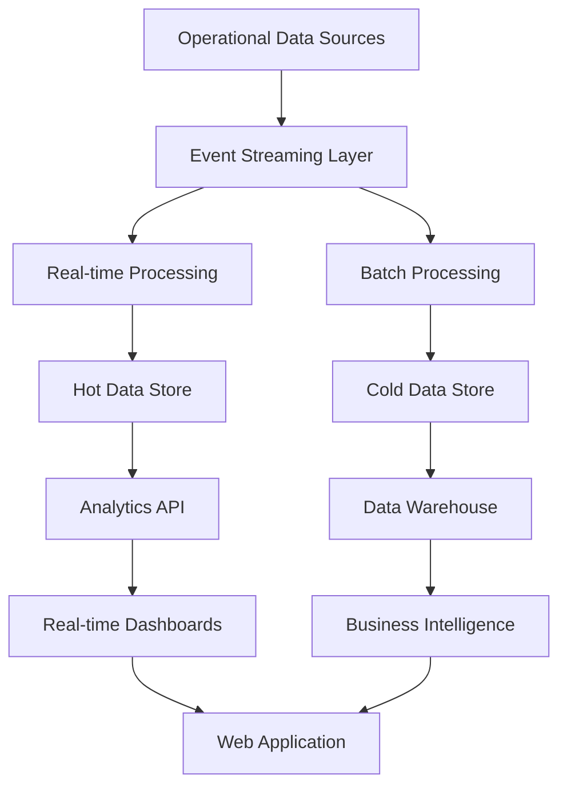

# Advanced Analytics & Business Intelligence Layer

## Overview

This document outlines the advanced analytics and business intelligence architecture designed to provide real-time insights, predictive analytics, and comprehensive reporting capabilities for enterprise-scale parking management operations.

## Analytics Architecture Overview

### Data Pipeline Architecture



### Data Flow Layers

**Layer 1: Data Ingestion**
- Real-time event streaming from microservices
- Batch ETL from legacy systems
- External data integration (weather, traffic, events)
- Data quality validation and enrichment

**Layer 2: Stream Processing**
- Real-time metric calculation
- Anomaly detection and alerting
- Event correlation and pattern detection
- Hot path analytics for live dashboards

**Layer 3: Batch Processing**
- Historical data analysis
- Complex aggregations and calculations
- Machine learning model training
- Data warehouse population

**Layer 4: Storage & Serving**
- Hot data store for real-time queries
- Cold storage for historical analysis
- Data warehouse for business intelligence
- Feature store for ML models

**Layer 5: Analytics Services**
- REST APIs for dashboard data
- GraphQL for flexible queries
- Streaming APIs for real-time updates
- Export services for reporting

## Real-Time Analytics Engine

### Stream Processing with Apache Kafka Streams

**Real-Time Metrics Calculation**:
```java
// Occupancy Rate Calculation
StreamsBuilder builder = new StreamsBuilder();
KStream<String, VehicleEvent> vehicleEvents = builder.stream("vehicle-events");

KTable<String, Long> currentOccupancy = vehicleEvents
    .filter((key, event) -> event.getEventType().equals("VehicleEntered") || 
                           event.getEventType().equals("VehicleExited"))
    .groupByKey()
    .aggregate(
        () -> 0L,
        (key, event, aggregate) -> {
            if (event.getEventType().equals("VehicleEntered")) {
                return aggregate + 1;
            } else {
                return Math.max(0, aggregate - 1);
            }
        },
        Materialized.<String, Long, KeyValueStore<Bytes, byte[]>>as("occupancy-store")
    );

// Revenue Calculation
KTable<String, Double> revenueByLocation = paymentEvents
    .filter((key, payment) -> payment.getStatus().equals("Paid"))
    .groupBy((key, payment) -> payment.getLocationId())
    .aggregate(
        () -> 0.0,
        (key, payment, aggregate) -> aggregate + payment.getAmount(),
        Materialized.as("revenue-store")
    );
```

### Real-Time KPI Dashboard Data

**Key Performance Indicators**:
```typescript
interface RealTimeKPIs {
  occupancyMetrics: {
    currentOccupancy: number
    occupancyRate: number
    availableSpaces: number
    peakOccupancy: number
    averageOccupancy: number
  }
  
  revenueMetrics: {
    todayRevenue: number
    revenueRate: number // per hour
    averageTransactionValue: number
    revenueByVehicleType: Record<string, number>
    projectedDailyRevenue: number
  }
  
  operationalMetrics: {
    averageStayDuration: number
    turnoverRate: number
    utilizationEfficiency: number
    overstayCount: number
    peakUtilizationTime: string
  }
  
  customerMetrics: {
    uniqueVisitors: number
    returningCustomers: number
    customerSatisfactionScore: number
    averageWaitTime: number
  }
}
```

### Anomaly Detection System

**Real-Time Anomaly Detection**:
```python
import numpy as np
from sklearn.ensemble import IsolationForest
import pandas as pd

class ParkingAnomalyDetector:
    def __init__(self):
        self.occupancy_model = IsolationForest(contamination=0.1)
        self.revenue_model = IsolationForest(contamination=0.1)
        self.duration_model = IsolationForest(contamination=0.1)
        self.trained = False
    
    def train_models(self, historical_data: pd.DataFrame):
        """Train anomaly detection models on historical data"""
        occupancy_features = self._extract_occupancy_features(historical_data)
        revenue_features = self._extract_revenue_features(historical_data)
        duration_features = self._extract_duration_features(historical_data)
        
        self.occupancy_model.fit(occupancy_features)
        self.revenue_model.fit(revenue_features)
        self.duration_model.fit(duration_features)
        self.trained = True
    
    def detect_anomalies(self, current_metrics: dict) -> dict:
        """Detect anomalies in current parking metrics"""
        if not self.trained:
            return {"anomalies": [], "status": "not_trained"}
        
        anomalies = []
        
        # Occupancy anomaly detection
        occupancy_score = self.occupancy_model.decision_function([[
            current_metrics['occupancy_rate'],
            current_metrics['hour_of_day'],
            current_metrics['day_of_week']
        ]])[0]
        
        if occupancy_score < -0.5:
            anomalies.append({
                "type": "occupancy_anomaly",
                "severity": "high" if occupancy_score < -0.7 else "medium",
                "description": f"Unusual occupancy pattern detected (score: {occupancy_score:.2f})",
                "current_value": current_metrics['occupancy_rate'],
                "expected_range": self._get_expected_range('occupancy', current_metrics)
            })
        
        # Revenue anomaly detection
        revenue_score = self.revenue_model.decision_function([[
            current_metrics['revenue_rate'],
            current_metrics['hour_of_day'],
            current_metrics['day_of_week']
        ]])[0]
        
        if revenue_score < -0.5:
            anomalies.append({
                "type": "revenue_anomaly",
                "severity": "high" if revenue_score < -0.7 else "medium",
                "description": f"Unusual revenue pattern detected (score: {revenue_score:.2f})",
                "current_value": current_metrics['revenue_rate'],
                "expected_range": self._get_expected_range('revenue', current_metrics)
            })
        
        return {
            "anomalies": anomalies,
            "status": "analyzed",
            "timestamp": pd.Timestamp.now().isoformat()
        }
```

## Business Intelligence & Reporting

### Data Warehouse Schema (Star Schema)

**Fact Tables**:
```sql
-- Parking Events Fact Table
CREATE TABLE fact_parking_events (
    event_id BIGINT PRIMARY KEY,
    location_id INTEGER REFERENCES dim_location(location_id),
    vehicle_id INTEGER REFERENCES dim_vehicle(vehicle_id),
    customer_id INTEGER REFERENCES dim_customer(customer_id),
    date_id INTEGER REFERENCES dim_date(date_id),
    time_id INTEGER REFERENCES dim_time(time_id),
    
    -- Measures
    parking_duration_minutes INTEGER,
    parking_fee DECIMAL(10,2),
    overstay_duration_minutes INTEGER DEFAULT 0,
    space_utilization_score DECIMAL(5,2),
    
    -- Event details
    entry_timestamp TIMESTAMP,
    exit_timestamp TIMESTAMP,
    payment_method VARCHAR(20),
    payment_status VARCHAR(20),
    
    created_at TIMESTAMP DEFAULT NOW()
);

-- Revenue Fact Table
CREATE TABLE fact_revenue (
    revenue_id BIGINT PRIMARY KEY,
    location_id INTEGER REFERENCES dim_location(location_id),
    date_id INTEGER REFERENCES dim_date(date_id),
    time_id INTEGER REFERENCES dim_time(time_id),
    payment_method_id INTEGER REFERENCES dim_payment_method(payment_method_id),
    
    -- Measures
    total_revenue DECIMAL(12,2),
    transaction_count INTEGER,
    average_transaction_value DECIMAL(10,2),
    refund_amount DECIMAL(10,2) DEFAULT 0,
    
    created_at TIMESTAMP DEFAULT NOW()
);
```

**Dimension Tables**:
```sql
-- Location Dimension
CREATE TABLE dim_location (
    location_id SERIAL PRIMARY KEY,
    location_name VARCHAR(100),
    location_type VARCHAR(50), -- 'airport', 'mall', 'hospital', etc.
    address TEXT,
    city VARCHAR(50),
    state VARCHAR(50),
    country VARCHAR(50),
    total_capacity INTEGER,
    gps_latitude DECIMAL(10, 8),
    gps_longitude DECIMAL(11, 8),
    timezone VARCHAR(50),
    
    -- SCD Type 2 fields
    effective_date DATE,
    expiry_date DATE,
    is_current BOOLEAN DEFAULT TRUE
);

-- Vehicle Dimension
CREATE TABLE dim_vehicle (
    vehicle_id SERIAL PRIMARY KEY,
    vehicle_number VARCHAR(50),
    vehicle_type VARCHAR(20),
    vehicle_category VARCHAR(30), -- 'commercial', 'personal', 'emergency'
    registration_state VARCHAR(50),
    
    -- SCD Type 1 fields
    first_seen_date DATE,
    last_seen_date DATE,
    total_visits INTEGER DEFAULT 1,
    
    created_at TIMESTAMP DEFAULT NOW(),
    updated_at TIMESTAMP DEFAULT NOW()
);

-- Time Dimension (Pre-populated)
CREATE TABLE dim_time (
    time_id SERIAL PRIMARY KEY,
    hour INTEGER,
    minute INTEGER,
    hour_of_day VARCHAR(10), -- '08:00-09:00'
    time_period VARCHAR(20), -- 'Morning', 'Afternoon', 'Evening', 'Night'
    business_hour BOOLEAN,
    peak_hour BOOLEAN
);

-- Date Dimension (Pre-populated)
CREATE TABLE dim_date (
    date_id SERIAL PRIMARY KEY,
    full_date DATE,
    year INTEGER,
    quarter INTEGER,
    month INTEGER,
    month_name VARCHAR(20),
    day_of_month INTEGER,
    day_of_year INTEGER,
    day_of_week INTEGER,
    day_name VARCHAR(20),
    week_of_year INTEGER,
    is_weekend BOOLEAN,
    is_holiday BOOLEAN,
    holiday_name VARCHAR(50),
    fiscal_year INTEGER,
    fiscal_quarter INTEGER
);
```

### Advanced Analytics Queries

**Customer Behavior Analysis**:
```sql
-- Customer Segmentation by Usage Patterns
WITH customer_metrics AS (
    SELECT 
        c.customer_id,
        COUNT(f.event_id) as visit_count,
        AVG(f.parking_duration_minutes) as avg_duration,
        SUM(f.parking_fee) as total_spent,
        MAX(f.entry_timestamp) as last_visit,
        EXTRACT(EPOCH FROM (MAX(f.entry_timestamp) - MIN(f.entry_timestamp))) / 86400 as customer_lifetime_days
    FROM fact_parking_events f
    JOIN dim_customer c ON f.customer_id = c.customer_id
    WHERE f.entry_timestamp >= CURRENT_DATE - INTERVAL '90 days'
    GROUP BY c.customer_id
),
customer_segments AS (
    SELECT 
        customer_id,
        visit_count,
        avg_duration,
        total_spent,
        CASE 
            WHEN visit_count >= 20 AND total_spent >= 500 THEN 'VIP'
            WHEN visit_count >= 10 AND total_spent >= 200 THEN 'Regular'
            WHEN visit_count >= 5 AND total_spent >= 100 THEN 'Frequent'
            WHEN visit_count >= 2 AND total_spent >= 50 THEN 'Occasional'
            ELSE 'New'
        END as customer_segment,
        CASE 
            WHEN customer_lifetime_days <= 7 THEN 'New'
            WHEN customer_lifetime_days <= 30 THEN 'Recent'
            WHEN customer_lifetime_days <= 90 THEN 'Active'
            ELSE 'Loyal'
        END as loyalty_segment
    FROM customer_metrics
)
SELECT 
    customer_segment,
    loyalty_segment,
    COUNT(*) as customer_count,
    AVG(visit_count) as avg_visits,
    AVG(total_spent) as avg_revenue,
    SUM(total_spent) as segment_revenue
FROM customer_segments
GROUP BY customer_segment, loyalty_segment
ORDER BY segment_revenue DESC;
```

**Revenue Optimization Analysis**:
```sql
-- Pricing Sensitivity Analysis
WITH hourly_metrics AS (
    SELECT 
        l.location_name,
        t.hour,
        t.time_period,
        d.day_name,
        COUNT(f.event_id) as transaction_count,
        AVG(f.parking_fee) as avg_fee,
        AVG(f.parking_duration_minutes) as avg_duration,
        SUM(f.parking_fee) / COUNT(f.event_id) as revenue_per_transaction,
        COUNT(f.event_id) / l.total_capacity::DECIMAL as utilization_rate
    FROM fact_parking_events f
    JOIN dim_location l ON f.location_id = l.location_id
    JOIN dim_time t ON f.time_id = t.time_id
    JOIN dim_date d ON f.date_id = d.date_id
    WHERE f.entry_timestamp >= CURRENT_DATE - INTERVAL '30 days'
    GROUP BY l.location_name, l.total_capacity, t.hour, t.time_period, d.day_name
),
price_elasticity AS (
    SELECT 
        location_name,
        hour,
        time_period,
        day_name,
        utilization_rate,
        avg_fee,
        -- Calculate price elasticity potential
        CASE 
            WHEN utilization_rate > 0.9 THEN 'Increase_Price' -- High demand
            WHEN utilization_rate > 0.7 THEN 'Maintain_Price' -- Optimal
            WHEN utilization_rate > 0.5 THEN 'Dynamic_Pricing' -- Variable
            ELSE 'Reduce_Price' -- Low demand
        END as pricing_recommendation,
        -- Potential revenue impact
        CASE 
            WHEN utilization_rate > 0.9 THEN avg_fee * 1.2 -- 20% increase potential
            WHEN utilization_rate < 0.5 THEN avg_fee * 0.8 -- 20% decrease to drive demand
            ELSE avg_fee
        END as suggested_price
    FROM hourly_metrics
)
SELECT 
    location_name,
    day_name,
    time_period,
    pricing_recommendation,
    COUNT(*) as hour_count,
    AVG(utilization_rate) as avg_utilization,
    AVG(avg_fee) as current_avg_price,
    AVG(suggested_price) as suggested_avg_price,
    (AVG(suggested_price) - AVG(avg_fee)) / AVG(avg_fee) * 100 as price_change_percent
FROM price_elasticity
GROUP BY location_name, day_name, time_period, pricing_recommendation
ORDER BY location_name, day_name, time_period;
```

### Machine Learning Models

**Demand Forecasting Model**:
```python
import pandas as pd
import numpy as np
from sklearn.ensemble import RandomForestRegressor
from sklearn.model_selection import TimeSeriesSplit
from sklearn.metrics import mean_absolute_error, mean_squared_error
import joblib

class ParkingDemandForecaster:
    def __init__(self):
        self.model = RandomForestRegressor(
            n_estimators=100,
            max_depth=10,
            random_state=42
        )
        self.feature_columns = []
        self.trained = False
    
    def prepare_features(self, df: pd.DataFrame) -> pd.DataFrame:
        """Prepare features for demand forecasting"""
        df = df.copy()
        
        # Time-based features
        df['hour'] = pd.to_datetime(df['timestamp']).dt.hour
        df['day_of_week'] = pd.to_datetime(df['timestamp']).dt.dayofweek
        df['month'] = pd.to_datetime(df['timestamp']).dt.month
        df['is_weekend'] = df['day_of_week'].isin([5, 6]).astype(int)
        
        # Lag features
        df['occupancy_lag_1h'] = df.groupby('location_id')['occupancy'].shift(1)
        df['occupancy_lag_24h'] = df.groupby('location_id')['occupancy'].shift(24)
        df['occupancy_lag_168h'] = df.groupby('location_id')['occupancy'].shift(168)  # 1 week
        
        # Rolling statistics
        df['occupancy_rolling_3h'] = df.groupby('location_id')['occupancy'].rolling(3).mean().reset_index(level=0, drop=True)
        df['occupancy_rolling_24h'] = df.groupby('location_id')['occupancy'].rolling(24).mean().reset_index(level=0, drop=True)
        
        # Weather features (if available)
        if 'temperature' in df.columns:
            df['temp_range'] = pd.cut(df['temperature'], bins=5, labels=['Very Cold', 'Cold', 'Moderate', 'Warm', 'Hot'])
            df = pd.get_dummies(df, columns=['temp_range'], prefix='temp')
        
        # Event features (if available)
        if 'event_nearby' in df.columns:
            df['event_impact'] = df['event_nearby'].astype(int)
        
        # Location features
        df = pd.get_dummies(df, columns=['location_type'], prefix='loc_type')
        
        return df.dropna()
    
    def train(self, training_data: pd.DataFrame):
        """Train the demand forecasting model"""
        df = self.prepare_features(training_data)
        
        # Define feature columns (exclude target and id columns)
        self.feature_columns = [col for col in df.columns 
                               if col not in ['occupancy', 'location_id', 'timestamp']]
        
        X = df[self.feature_columns]
        y = df['occupancy']
        
        # Time series cross-validation
        tscv = TimeSeriesSplit(n_splits=5)
        scores = []
        
        for train_idx, val_idx in tscv.split(X):
            X_train, X_val = X.iloc[train_idx], X.iloc[val_idx]
            y_train, y_val = y.iloc[train_idx], y.iloc[val_idx]
            
            self.model.fit(X_train, y_train)
            y_pred = self.model.predict(X_val)
            scores.append(mean_absolute_error(y_val, y_pred))
        
        # Final training on all data
        self.model.fit(X, y)
        self.trained = True
        
        return {
            'mean_cv_mae': np.mean(scores),
            'std_cv_mae': np.std(scores),
            'feature_importance': dict(zip(self.feature_columns, self.model.feature_importances_))
        }
    
    def predict(self, data: pd.DataFrame, hours_ahead: int = 24) -> pd.DataFrame:
        """Predict parking demand for specified hours ahead"""
        if not self.trained:
            raise ValueError("Model must be trained before making predictions")
        
        predictions = []
        current_data = data.copy()
        
        for hour in range(hours_ahead):
            # Prepare features for current time step
            features_df = self.prepare_features(current_data)
            X = features_df[self.feature_columns].tail(1)
            
            # Make prediction
            pred = self.model.predict(X)[0]
            
            # Store prediction
            next_timestamp = pd.to_datetime(current_data['timestamp'].iloc[-1]) + pd.Timedelta(hours=1)
            predictions.append({
                'timestamp': next_timestamp,
                'predicted_occupancy': pred,
                'confidence_interval_lower': pred * 0.85,  # Simplified CI
                'confidence_interval_upper': pred * 1.15
            })
            
            # Update data for next prediction
            new_row = current_data.iloc[-1].copy()
            new_row['timestamp'] = next_timestamp
            new_row['occupancy'] = pred
            current_data = pd.concat([current_data, pd.DataFrame([new_row])], ignore_index=True)
        
        return pd.DataFrame(predictions)
    
    def save_model(self, filepath: str):
        """Save trained model to file"""
        model_data = {
            'model': self.model,
            'feature_columns': self.feature_columns,
            'trained': self.trained
        }
        joblib.dump(model_data, filepath)
    
    def load_model(self, filepath: str):
        """Load trained model from file"""
        model_data = joblib.load(filepath)
        self.model = model_data['model']
        self.feature_columns = model_data['feature_columns']
        self.trained = model_data['trained']
```

**Revenue Optimization Model**:
```python
class RevenueOptimizer:
    def __init__(self):
        self.price_elasticity_model = RandomForestRegressor(n_estimators=50)
        self.demand_model = RandomForestRegressor(n_estimators=50)
        self.trained = False
    
    def train_elasticity_model(self, historical_data: pd.DataFrame):
        """Train price elasticity model"""
        # Features: current_price, occupancy_rate, hour, day_of_week, weather
        # Target: demand_change_rate
        
        features = ['current_price', 'occupancy_rate', 'hour', 'day_of_week', 'temperature']
        target = 'demand_change_rate'
        
        X = historical_data[features]
        y = historical_data[target]
        
        self.price_elasticity_model.fit(X, y)
        self.trained = True
    
    def optimize_pricing(self, current_conditions: dict, price_range: tuple = (50, 300)) -> dict:
        """Find optimal price for maximum revenue"""
        if not self.trained:
            raise ValueError("Model must be trained first")
        
        best_revenue = 0
        optimal_price = current_conditions['current_price']
        
        # Test different price points
        for price in range(price_range[0], price_range[1], 10):
            # Predict demand change
            features = np.array([[
                price,
                current_conditions['occupancy_rate'],
                current_conditions['hour'],
                current_conditions['day_of_week'],
                current_conditions['temperature']
            ]])
            
            demand_change = self.price_elasticity_model.predict(features)[0]
            predicted_demand = current_conditions['current_demand'] * (1 + demand_change)
            predicted_revenue = price * predicted_demand
            
            if predicted_revenue > best_revenue:
                best_revenue = predicted_revenue
                optimal_price = price
        
        return {
            'optimal_price': optimal_price,
            'predicted_revenue': best_revenue,
            'current_revenue': current_conditions['current_price'] * current_conditions['current_demand'],
            'revenue_uplift': (best_revenue - current_conditions['current_price'] * current_conditions['current_demand']) / (current_conditions['current_price'] * current_conditions['current_demand']) * 100
        }
```

### Analytics API Endpoints

**Real-Time Analytics API**:
```typescript
interface AnalyticsAPI {
  // Real-time KPIs
  GET /analytics/realtime/kpis/{locationId}: → RealTimeKPIs
  GET /analytics/realtime/occupancy: → OccupancyMetrics[]
  GET /analytics/realtime/revenue: → RevenueMetrics
  
  // Forecasting
  POST /analytics/forecast/demand: {
    locationId: string
    hoursAhead: number
    includeWeather?: boolean
  } → DemandForecast
  
  POST /analytics/forecast/revenue: {
    locationId: string
    timeHorizon: 'day' | 'week' | 'month'
  } → RevenueForecast
  
  // Optimization
  POST /analytics/optimize/pricing: {
    locationId: string
    currentConditions: MarketConditions
  } → PricingRecommendation
  
  // Anomaly Detection
  GET /analytics/anomalies/{locationId}: → AnomalyReport
  POST /analytics/anomalies/alert: {
    thresholds: AnomalyThresholds
  } → AlertConfiguration
  
  // Business Intelligence
  POST /analytics/reports/generate: {
    reportType: 'customer_behavior' | 'revenue_analysis' | 'operational_efficiency'
    parameters: ReportParameters
  } → Report
  
  GET /analytics/reports/{reportId}: → Report
  POST /analytics/reports/export: {
    reportId: string
    format: 'pdf' | 'excel' | 'csv'
  } → ExportJob
}
```

### Performance Monitoring & Optimization

**Analytics Performance Targets**:
```yaml
Real-time Analytics:
  - KPI calculation: <100ms
  - Dashboard data: <200ms
  - Anomaly detection: <500ms
  
Batch Analytics:
  - Daily reports: <5 minutes
  - Weekly reports: <15 minutes
  - Monthly reports: <30 minutes
  
Machine Learning:
  - Demand forecasting: <2 seconds
  - Price optimization: <1 second
  - Model training: <10 minutes (daily)
  
Data Pipeline:
  - Stream processing lag: <1 second
  - Batch processing SLA: 95% within 1 hour
  - Data freshness: <30 seconds for real-time data
```

**Caching Strategy**:
```yaml
Redis Cache Layers:
  Level 1: Real-time KPIs (TTL: 30 seconds)
  Level 2: Aggregated metrics (TTL: 5 minutes)
  Level 3: Historical summaries (TTL: 1 hour)
  Level 4: ML model predictions (TTL: 15 minutes)

Cache Warming:
  - Pre-calculate popular queries
  - Predictive cache loading based on usage patterns
  - Background cache refresh for critical metrics
```

This advanced analytics and business intelligence layer provides comprehensive insights, predictive capabilities, and optimization recommendations to maximize parking operation efficiency and revenue.