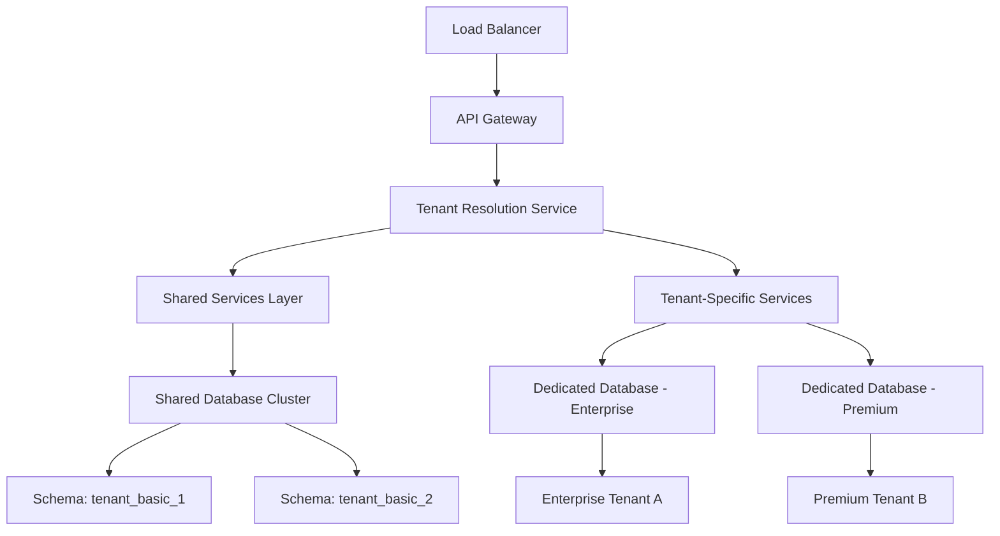

# Enterprise Deployment Patterns & Multi-Tenancy Architecture

## Overview

This document outlines enterprise-grade deployment patterns and comprehensive multi-tenancy architecture designed to support large-scale organizations, SaaS offerings, and complex enterprise requirements while maintaining security, performance, and operational efficiency.

## Multi-Tenancy Architecture

### Tenancy Models Overview

**Tenant Isolation Levels**:
1. **Shared Database, Shared Schema** - Cost-effective, high density
2. **Shared Database, Separate Schema** - Balanced isolation and cost
3. **Separate Database per Tenant** - Maximum isolation, compliance-ready
4. **Hybrid Multi-Tier** - Flexible based on tenant requirements

### Recommended Hybrid Architecture



### Tenant Data Model

```sql
-- Tenant Management Schema
CREATE SCHEMA tenant_management;

-- Tenant Registry
CREATE TABLE tenant_management.tenants (
    tenant_id UUID PRIMARY KEY DEFAULT gen_random_uuid(),
    tenant_code VARCHAR(50) UNIQUE NOT NULL, -- URL-friendly identifier
    company_name VARCHAR(200) NOT NULL,
    subscription_tier VARCHAR(50) NOT NULL, -- 'basic', 'premium', 'enterprise'
    isolation_level VARCHAR(50) NOT NULL, -- 'shared_schema', 'dedicated_schema', 'dedicated_db'
    
    -- Deployment configuration
    region VARCHAR(50) NOT NULL,
    data_residency_requirements TEXT[],
    compliance_requirements TEXT[], -- 'SOC2', 'GDPR', 'HIPAA', etc.
    
    -- Resource limits
    max_locations INTEGER DEFAULT 5,
    max_users INTEGER DEFAULT 50,
    max_monthly_transactions INTEGER DEFAULT 10000,
    storage_quota_gb INTEGER DEFAULT 10,
    
    -- Database configuration
    database_host VARCHAR(255),
    database_name VARCHAR(100),
    schema_name VARCHAR(100),
    connection_pool_size INTEGER DEFAULT 10,
    
    -- Feature flags
    features JSONB DEFAULT '{}',
    custom_branding_enabled BOOLEAN DEFAULT false,
    api_access_enabled BOOLEAN DEFAULT false,
    advanced_analytics_enabled BOOLEAN DEFAULT false,
    
    -- Billing
    billing_email VARCHAR(255),
    billing_address JSONB,
    payment_method_id VARCHAR(100),
    
    -- Status and lifecycle
    status VARCHAR(50) DEFAULT 'active', -- 'active', 'suspended', 'terminated', 'migrating'
    created_at TIMESTAMP DEFAULT NOW(),
    activated_at TIMESTAMP,
    suspended_at TIMESTAMP,
    terminated_at TIMESTAMP,
    
    -- Metadata
    created_by UUID REFERENCES tenant_management.admin_users(user_id),
    last_modified TIMESTAMP DEFAULT NOW(),
    metadata JSONB DEFAULT '{}'
);

-- Tenant Users
CREATE TABLE tenant_management.tenant_users (
    user_id UUID PRIMARY KEY DEFAULT gen_random_uuid(),
    tenant_id UUID REFERENCES tenant_management.tenants(tenant_id),
    email VARCHAR(255) UNIQUE NOT NULL,
    username VARCHAR(100),
    role VARCHAR(50) NOT NULL, -- 'tenant_admin', 'user', 'viewer'
    
    -- User details
    full_name VARCHAR(200),
    phone VARCHAR(20),
    timezone VARCHAR(50) DEFAULT 'UTC',
    language VARCHAR(10) DEFAULT 'en',
    
    -- Authentication
    password_hash VARCHAR(255),
    mfa_enabled BOOLEAN DEFAULT false,
    mfa_secret VARCHAR(100),
    
    -- Status
    is_active BOOLEAN DEFAULT true,
    email_verified BOOLEAN DEFAULT false,
    last_login TIMESTAMP,
    failed_login_attempts INTEGER DEFAULT 0,
    locked_until TIMESTAMP,
    
    -- Audit
    created_at TIMESTAMP DEFAULT NOW(),
    updated_at TIMESTAMP DEFAULT NOW(),
    created_by UUID,
    
    CONSTRAINT valid_email CHECK (email ~* '^[A-Za-z0-9._%+-]+@[A-Za-z0-9.-]+\.[A-Za-z]{2,}$')
);

-- Tenant Configurations
CREATE TABLE tenant_management.tenant_configurations (
    config_id UUID PRIMARY KEY DEFAULT gen_random_uuid(),
    tenant_id UUID REFERENCES tenant_management.tenants(tenant_id),
    config_category VARCHAR(50) NOT NULL, -- 'branding', 'features', 'integrations', 'security'
    config_key VARCHAR(100) NOT NULL,
    config_value JSONB NOT NULL,
    
    -- Metadata
    description TEXT,
    is_sensitive BOOLEAN DEFAULT false,
    created_at TIMESTAMP DEFAULT NOW(),
    updated_at TIMESTAMP DEFAULT NOW(),
    updated_by UUID REFERENCES tenant_management.tenant_users(user_id),
    
    UNIQUE(tenant_id, config_category, config_key)
);

-- Tenant Resource Usage
CREATE TABLE tenant_management.tenant_usage (
    usage_id UUID PRIMARY KEY DEFAULT gen_random_uuid(),
    tenant_id UUID REFERENCES tenant_management.tenants(tenant_id),
    resource_type VARCHAR(50) NOT NULL, -- 'storage', 'api_calls', 'users', 'locations'
    usage_date DATE NOT NULL,
    
    -- Usage metrics
    current_usage DECIMAL(12,2),
    peak_usage DECIMAL(12,2),
    quota DECIMAL(12,2),
    unit VARCHAR(20), -- 'GB', 'count', 'requests'
    
    -- Billing
    billable_usage DECIMAL(12,2),
    unit_cost DECIMAL(10,4),
    total_cost DECIMAL(12,2),
    
    created_at TIMESTAMP DEFAULT NOW(),
    
    UNIQUE(tenant_id, resource_type, usage_date)
);
```

### Tenant Resolution Service

```typescript
interface TenantResolutionService {
  resolveTenant(request: Request): Promise<TenantContext>
  validateTenantAccess(tenantId: string, userId: string): Promise<boolean>
  getTenantConfiguration(tenantId: string): Promise<TenantConfig>
  checkResourceLimits(tenantId: string, resourceType: string): Promise<ResourceCheck>
}

class TenantResolver {
  private tenantCache = new Map<string, TenantContext>()
  private configCache = new Map<string, TenantConfig>()
  
  async resolveTenant(request: Request): Promise<TenantContext> {
    // Resolution strategies in order of preference
    const resolutionStrategies = [
      this.resolveBySubdomain,
      this.resolveByDomain,
      this.resolveByHeader,
      this.resolveByPath,
      this.resolveByToken
    ]
    
    for (const strategy of resolutionStrategies) {
      try {
        const tenantContext = await strategy.call(this, request)
        if (tenantContext) {
          return this.enrichTenantContext(tenantContext)
        }
      } catch (error) {
        console.warn(`Tenant resolution strategy failed: ${strategy.name}`, error)
      }
    }
    
    throw new TenantResolutionError('Unable to resolve tenant from request')
  }
  
  private async resolveBySubdomain(request: Request): Promise<TenantContext | null> {
    const host = request.headers.get('host')
    if (!host) return null
    
    const subdomain = host.split('.')[0]
    if (subdomain === 'www' || subdomain === 'api') return null
    
    return this.findTenantByCode(subdomain)
  }
  
  private async resolveByDomain(request: Request): Promise<TenantContext | null> {
    const host = request.headers.get('host')
    if (!host) return null
    
    // Check for custom domain mapping
    const tenant = await this.tenantRepository.findByCustomDomain(host)
    return tenant ? this.mapToTenantContext(tenant) : null
  }
  
  private async resolveByHeader(request: Request): Promise<TenantContext | null> {
    const tenantId = request.headers.get('x-tenant-id')
    const tenantCode = request.headers.get('x-tenant-code')
    
    if (tenantId) {
      return this.findTenantById(tenantId)
    }
    
    if (tenantCode) {
      return this.findTenantByCode(tenantCode)
    }
    
    return null
  }
  
  private async enrichTenantContext(context: TenantContext): Promise<TenantContext> {
    // Load tenant configuration
    const config = await this.getTenantConfiguration(context.tenantId)
    
    // Check resource limits and usage
    const usage = await this.getTenantUsage(context.tenantId)
    
    // Load feature flags
    const features = await this.getTenantFeatures(context.tenantId)
    
    return {
      ...context,
      configuration: config,
      usage,
      features,
      limits: this.calculateCurrentLimits(context, usage)
    }
  }
  
  async validateTenantAccess(tenantId: string, userId: string): Promise<boolean> {
    const tenantUser = await this.tenantRepository.findTenantUser(tenantId, userId)
    
    return tenantUser && 
           tenantUser.isActive && 
           !tenantUser.isLocked &&
           tenantUser.tenant.status === 'active'
  }
  
  async checkResourceLimits(tenantId: string, resourceType: string): Promise<ResourceCheck> {
    const tenant = await this.findTenantById(tenantId)
    const usage = await this.getCurrentUsage(tenantId, resourceType)
    const limit = this.getResourceLimit(tenant, resourceType)
    
    return {
      resourceType,
      currentUsage: usage,
      limit,
      available: limit - usage,
      utilizationPercentage: (usage / limit) * 100,
      isOverLimit: usage > limit,
      warningThreshold: limit * 0.8,
      isNearLimit: usage > (limit * 0.8)
    }
  }
}
```

## Enterprise Deployment Patterns

### Multi-Region Deployment Architecture

```yaml
Global Infrastructure:
  Regions:
    Primary: us-east-1 (N. Virginia)
      - Production workloads
      - Primary databases
      - Global services
    
    Secondary: eu-west-1 (Ireland)
      - European customers (GDPR compliance)
      - Disaster recovery
      - Regional services
    
    Asia-Pacific: ap-southeast-1 (Singapore)
      - APAC customers
      - Data residency compliance
      - Edge services
  
  Cross-Region Services:
    - Global Load Balancer (Route 53)
    - CDN Distribution (CloudFront)
    - DNS Management
    - Certificate Management
    - Global Monitoring
  
  Data Residency:
    - EU customers: Data stored in EU region only
    - US customers: Data can be replicated globally
    - APAC customers: Data stored in APAC region
    - Enterprise: Custom data residency requirements
```

### Kubernetes Deployment Configuration

**Production Cluster Setup**:
```yaml
# Production namespace configuration
apiVersion: v1
kind: Namespace
metadata:
  name: parking-production
  labels:
    environment: production
    tenant-isolation: enabled
---
# Tenant-specific namespace
apiVersion: v1
kind: Namespace
metadata:
  name: parking-tenant-enterprise-001
  labels:
    environment: production
    tenant-id: "enterprise-001"
    isolation-level: "dedicated"
---
# Multi-tenant application deployment
apiVersion: apps/v1
kind: Deployment
metadata:
  name: parking-app
  namespace: parking-production
spec:
  replicas: 10
  selector:
    matchLabels:
      app: parking-app
  template:
    metadata:
      labels:
        app: parking-app
    spec:
      containers:
      - name: parking-app
        image: parking/app:v2.1.0
        env:
        - name: TENANT_RESOLUTION_MODE
          value: "multi-tenant"
        - name: DATABASE_MODE
          value: "multi-tenant"
        - name: ISOLATION_LEVEL
          value: "schema"
        resources:
          requests:
            cpu: 500m
            memory: 1Gi
          limits:
            cpu: 2000m
            memory: 4Gi
        livenessProbe:
          httpGet:
            path: /health/live
            port: 8080
          initialDelaySeconds: 30
          periodSeconds: 10
        readinessProbe:
          httpGet:
            path: /health/ready
            port: 8080
          initialDelaySeconds: 5
          periodSeconds: 5
---
# Enterprise tenant dedicated deployment
apiVersion: apps/v1
kind: Deployment
metadata:
  name: parking-app-enterprise-001
  namespace: parking-tenant-enterprise-001
spec:
  replicas: 5
  selector:
    matchLabels:
      app: parking-app
      tenant: enterprise-001
  template:
    metadata:
      labels:
        app: parking-app
        tenant: enterprise-001
    spec:
      nodeSelector:
        instance-type: c5.2xlarge
        dedicated-tenant: enterprise-001
      containers:
      - name: parking-app
        image: parking/app:v2.1.0-enterprise
        env:
        - name: TENANT_ID
          value: "enterprise-001"
        - name: TENANT_RESOLUTION_MODE
          value: "single-tenant"
        - name: DATABASE_MODE
          value: "dedicated"
        - name: DATABASE_URL
          valueFrom:
            secretKeyRef:
              name: enterprise-001-db-secret
              key: connection-string
        resources:
          requests:
            cpu: 1000m
            memory: 2Gi
          limits:
            cpu: 4000m
            memory: 8Gi
        volumeMounts:
        - name: tenant-config
          mountPath: /app/config/tenant
        - name: custom-assets
          mountPath: /app/public/tenant-assets
      volumes:
      - name: tenant-config
        configMap:
          name: enterprise-001-config
      - name: custom-assets
        persistentVolumeClaim:
          claimName: enterprise-001-assets
```

### Database Deployment Patterns

**Multi-Tenant Database Configuration**:
```yaml
# Shared Database Cluster (Basic/Premium Tenants)
Shared PostgreSQL Cluster:
  Primary Instance:
    - Instance Type: db.r6g.4xlarge
    - Storage: 2TB GP3 SSD
    - Connections: 1000 max
    - CPU: 16 vCPUs, 128GB RAM
  
  Read Replicas:
    - Count: 3 per region
    - Instance Type: db.r6g.2xlarge
    - Auto-scaling enabled
    - Cross-AZ deployment
  
  Schema Isolation:
    - tenant_basic_001 to tenant_basic_999
    - tenant_premium_001 to tenant_premium_199
    - Automated schema provisioning
    - Resource quotas per schema

# Dedicated Databases (Enterprise Tenants)
Enterprise Database Instances:
  Configuration:
    - Instance Type: db.r6g.xlarge to db.r6g.8xlarge
    - Storage: 500GB to 10TB based on requirements
    - Backup retention: 30 days
    - Encryption at rest: Required
    - VPC isolation: Private subnets
  
  High Availability:
    - Multi-AZ deployment
    - Automated failover
    - Cross-region replication for DR
    - Point-in-time recovery
```

**Connection Pooling Strategy**:
```typescript
// Multi-tenant connection pooling
class TenantConnectionManager {
  private connectionPools = new Map<string, Pool>()
  private sharedPool: Pool
  
  constructor() {
    // Shared pool for basic tenants
    this.sharedPool = new Pool({
      connectionString: process.env.SHARED_DATABASE_URL,
      max: 100,
      idleTimeoutMillis: 30000,
      connectionTimeoutMillis: 2000,
    })
    
    this.initializeEnterpriseConnections()
  }
  
  async getConnection(tenantContext: TenantContext): Promise<PoolClient> {
    const tenantId = tenantContext.tenantId
    const isolationLevel = tenantContext.isolationLevel
    
    switch (isolationLevel) {
      case 'dedicated_database':
        return this.getDedicatedConnection(tenantId)
      
      case 'dedicated_schema':
        return this.getSchemaConnection(tenantContext)
      
      case 'shared_schema':
      default:
        return this.getSharedConnection(tenantContext)
    }
  }
  
  private async getDedicatedConnection(tenantId: string): Promise<PoolClient> {
    let pool = this.connectionPools.get(tenantId)
    
    if (!pool) {
      const tenant = await this.tenantRepository.findById(tenantId)
      pool = new Pool({
        host: tenant.databaseHost,
        database: tenant.databaseName,
        user: tenant.databaseUser,
        password: await this.secretManager.getSecret(`tenant-${tenantId}-db-password`),
        max: tenant.connectionPoolSize || 10,
        ssl: { rejectUnauthorized: false }
      })
      
      this.connectionPools.set(tenantId, pool)
    }
    
    return pool.connect()
  }
  
  private async getSchemaConnection(tenantContext: TenantContext): Promise<PoolClient> {
    const client = await this.sharedPool.connect()
    
    // Set schema for this connection
    await client.query(`SET search_path TO ${tenantContext.schemaName}, public`)
    
    // Set tenant context for RLS
    await client.query(`SET app.current_tenant_id = '${tenantContext.tenantId}'`)
    
    return client
  }
  
  private async getSharedConnection(tenantContext: TenantContext): Promise<PoolClient> {
    const client = await this.sharedPool.connect()
    
    // Set tenant context for RLS and queries
    await client.query(`SET app.current_tenant_id = '${tenantContext.tenantId}'`)
    
    return client
  }
}
```

### Container Orchestration for Multi-Tenancy

**Tenant Isolation Strategies**:
```yaml
# Network Policies for Tenant Isolation
apiVersion: networking.k8s.io/v1
kind: NetworkPolicy
metadata:
  name: tenant-isolation
  namespace: parking-tenant-enterprise-001
spec:
  podSelector: {}
  policyTypes:
  - Ingress
  - Egress
  ingress:
  - from:
    - namespaceSelector:
        matchLabels:
          name: parking-shared-services
    - namespaceSelector:
        matchLabels:
          name: parking-tenant-enterprise-001
  egress:
  - to:
    - namespaceSelector:
        matchLabels:
          name: parking-shared-services
  - to: []
    ports:
    - protocol: TCP
      port: 443 # HTTPS
    - protocol: TCP
      port: 53 # DNS
---
# Resource Quotas per Tenant
apiVersion: v1
kind: ResourceQuota
metadata:
  name: enterprise-001-quota
  namespace: parking-tenant-enterprise-001
spec:
  hard:
    requests.cpu: "10"
    requests.memory: 20Gi
    limits.cpu: "20"
    limits.memory: 40Gi
    persistentvolumeclaims: "10"
    services: "5"
    secrets: "20"
    configmaps: "20"
---
# Pod Security Policy
apiVersion: policy/v1beta1
kind: PodSecurityPolicy
metadata:
  name: tenant-psp
spec:
  privileged: false
  allowPrivilegeEscalation: false
  requiredDropCapabilities:
    - ALL
  volumes:
    - 'configMap'
    - 'emptyDir'
    - 'projected'
    - 'secret'
    - 'downwardAPI'
    - 'persistentVolumeClaim'
  runAsUser:
    rule: 'MustRunAsNonRoot'
  seLinux:
    rule: 'RunAsAny'
  fsGroup:
    rule: 'RunAsAny'
```

## SaaS Multi-Tenancy Implementation

### Subscription Management

```typescript
interface SubscriptionService {
  createTenant(request: CreateTenantRequest): Promise<Tenant>
  upgradeTenant(tenantId: string, newTier: string): Promise<void>
  suspendTenant(tenantId: string, reason: string): Promise<void>
  deleteTenant(tenantId: string): Promise<void>
}

class SaaSSubscriptionManager implements SubscriptionService {
  async createTenant(request: CreateTenantRequest): Promise<Tenant> {
    const transaction = await this.db.beginTransaction()
    
    try {
      // 1. Create tenant record
      const tenant = await this.tenantRepository.create({
        tenantCode: request.tenantCode,
        companyName: request.companyName,
        subscriptionTier: request.subscriptionTier,
        isolationLevel: this.determineIsolationLevel(request.subscriptionTier),
        region: request.preferredRegion || 'us-east-1',
        maxLocations: this.getTierLimits(request.subscriptionTier).locations,
        maxUsers: this.getTierLimits(request.subscriptionTier).users
      })
      
      // 2. Provision database resources
      if (tenant.isolationLevel === 'dedicated_database') {
        await this.provisionDedicatedDatabase(tenant)
      } else if (tenant.isolationLevel === 'dedicated_schema') {
        await this.provisionTenantSchema(tenant)
      }
      
      // 3. Create tenant admin user
      const adminUser = await this.userService.createTenantAdmin({
        tenantId: tenant.tenantId,
        email: request.adminEmail,
        fullName: request.adminName,
        password: request.adminPassword
      })
      
      // 4. Initialize tenant configuration
      await this.configurationService.initializeTenantConfig(tenant.tenantId, {
        branding: this.getDefaultBranding(),
        features: this.getTierFeatures(request.subscriptionTier),
        security: this.getDefaultSecurityConfig()
      })
      
      // 5. Set up billing
      await this.billingService.createSubscription({
        tenantId: tenant.tenantId,
        tier: request.subscriptionTier,
        paymentMethodId: request.paymentMethodId,
        billingEmail: request.billingEmail
      })
      
      // 6. Deploy tenant-specific resources
      if (tenant.isolationLevel === 'dedicated_database') {
        await this.deploymentService.deployDedicatedInfrastructure(tenant)
      }
      
      await transaction.commit()
      
      // 7. Send welcome email and setup instructions
      await this.notificationService.sendWelcomeEmail(adminUser)
      
      return tenant
      
    } catch (error) {
      await transaction.rollback()
      throw new TenantCreationError(`Failed to create tenant: ${error.message}`)
    }
  }
  
  private async provisionDedicatedDatabase(tenant: Tenant): Promise<void> {
    const dbConfig = {
      instanceClass: this.getInstanceClass(tenant.subscriptionTier),
      storageSize: this.getStorageSize(tenant.subscriptionTier),
      multiAZ: tenant.subscriptionTier !== 'basic',
      backupRetention: this.getBackupRetention(tenant.subscriptionTier),
      encryption: true,
      vpcSecurityGroups: [this.getTenantSecurityGroup(tenant.tenantId)]
    }
    
    const dbInstance = await this.rdsService.createDatabase({
      ...dbConfig,
      dbInstanceIdentifier: `parking-${tenant.tenantCode}`,
      dbName: `parking_${tenant.tenantCode.replace('-', '_')}`,
      masterUsername: 'parking_admin',
      masterPassword: await this.secretManager.generatePassword()
    })
    
    // Update tenant with database connection info
    await this.tenantRepository.update(tenant.tenantId, {
      databaseHost: dbInstance.endpoint,
      databaseName: dbInstance.dbName,
      databasePort: dbInstance.port
    })
    
    // Store connection credentials securely
    await this.secretManager.storeSecret(
      `tenant-${tenant.tenantId}-db-credentials`,
      {
        host: dbInstance.endpoint,
        database: dbInstance.dbName,
        username: 'parking_admin',
        password: dbInstance.masterPassword,
        port: dbInstance.port
      }
    )
  }
  
  async upgradeTenant(tenantId: string, newTier: string): Promise<void> {
    const tenant = await this.tenantRepository.findById(tenantId)
    const currentLimits = this.getTierLimits(tenant.subscriptionTier)
    const newLimits = this.getTierLimits(newTier)
    
    // Check if upgrade requires infrastructure changes
    const requiresInfrastructureUpgrade = this.requiresInfrastructureChange(
      tenant.subscriptionTier, 
      newTier
    )
    
    const transaction = await this.db.beginTransaction()
    
    try {
      // 1. Update tenant subscription tier
      await this.tenantRepository.update(tenantId, {
        subscriptionTier: newTier,
        maxLocations: newLimits.locations,
        maxUsers: newLimits.users,
        storageQuotaGb: newLimits.storageGb
      })
      
      // 2. Update feature flags
      const newFeatures = this.getTierFeatures(newTier)
      await this.configurationService.updateTenantFeatures(tenantId, newFeatures)
      
      // 3. Infrastructure upgrades if needed
      if (requiresInfrastructureUpgrade) {
        if (newTier === 'enterprise' && tenant.isolationLevel !== 'dedicated_database') {
          // Migrate to dedicated database
          await this.migrateToEnterpriseInfrastructure(tenant)
        } else if (tenant.isolationLevel === 'dedicated_database') {
          // Scale existing dedicated infrastructure
          await this.scaleEnterpriseInfrastructure(tenant, newTier)
        }
      }
      
      // 4. Update billing
      await this.billingService.changeSubscription(tenantId, newTier)
      
      await transaction.commit()
      
      // 5. Notify tenant admin
      await this.notificationService.sendUpgradeConfirmation(tenantId, newTier)
      
    } catch (error) {
      await transaction.rollback()
      throw new TenantUpgradeError(`Failed to upgrade tenant: ${error.message}`)
    }
  }
}
```

### Resource Monitoring & Enforcement

```typescript
class TenantResourceMonitor {
  private readonly usageCollectors: Map<string, UsageCollector>
  
  constructor() {
    this.usageCollectors = new Map([
      ['storage', new StorageUsageCollector()],
      ['api_calls', new APIUsageCollector()],
      ['users', new UserCountCollector()],
      ['locations', new LocationCountCollector()]
    ])
  }
  
  async collectUsageMetrics(tenantId: string): Promise<UsageMetrics> {
    const tenant = await this.tenantRepository.findById(tenantId)
    const metrics: UsageMetrics = {}
    
    for (const [resourceType, collector] of this.usageCollectors) {
      try {
        const usage = await collector.collect(tenant)
        metrics[resourceType] = usage
        
        // Store usage data
        await this.usageRepository.recordUsage({
          tenantId,
          resourceType,
          usageDate: new Date(),
          currentUsage: usage.current,
          peakUsage: usage.peak,
          quota: usage.quota
        })
        
        // Check limits and trigger alerts if necessary
        await this.checkLimitsAndAlert(tenant, resourceType, usage)
        
      } catch (error) {
        console.error(`Failed to collect ${resourceType} usage for tenant ${tenantId}:`, error)
      }
    }
    
    return metrics
  }
  
  private async checkLimitsAndAlert(
    tenant: Tenant, 
    resourceType: string, 
    usage: ResourceUsage
  ): Promise<void> {
    const utilizationPercentage = (usage.current / usage.quota) * 100
    
    // Soft limit warning (80%)
    if (utilizationPercentage > 80 && utilizationPercentage < 95) {
      await this.notificationService.sendUsageWarning(tenant.tenantId, {
        resourceType,
        currentUsage: usage.current,
        quota: usage.quota,
        utilizationPercentage
      })
    }
    
    // Hard limit enforcement (100%)
    if (utilizationPercentage >= 100) {
      await this.enforceResourceLimit(tenant, resourceType, usage)
    }
  }
  
  private async enforceResourceLimit(
    tenant: Tenant,
    resourceType: string,
    usage: ResourceUsage
  ): Promise<void> {
    switch (resourceType) {
      case 'storage':
        // Prevent new data writes
        await this.setTenantFlag(tenant.tenantId, 'storage_writes_blocked', true)
        break
        
      case 'api_calls':
        // Rate limit API requests
        await this.setTenantRateLimit(tenant.tenantId, 0.1) // Very low limit
        break
        
      case 'users':
        // Prevent new user creation
        await this.setTenantFlag(tenant.tenantId, 'user_creation_blocked', true)
        break
        
      case 'locations':
        // Prevent new location creation
        await this.setTenantFlag(tenant.tenantId, 'location_creation_blocked', true)
        break
    }
    
    // Send limit exceeded notification
    await this.notificationService.sendLimitExceededAlert(tenant.tenantId, {
      resourceType,
      currentUsage: usage.current,
      quota: usage.quota,
      action: 'Resource access restricted'
    })
  }
}
```

## Security & Compliance

### Data Isolation & Security

```typescript
// Row-Level Security (RLS) Implementation
const setupRowLevelSecurity = async (db: DatabaseConnection) => {
  // Enable RLS on tenant tables
  await db.query(`
    ALTER TABLE parking_entries ENABLE ROW LEVEL SECURITY;
    ALTER TABLE payments ENABLE ROW LEVEL SECURITY;
    ALTER TABLE users ENABLE ROW LEVEL SECURITY;
    ALTER TABLE locations ENABLE ROW LEVEL SECURITY;
  `)
  
  // Create RLS policies
  await db.query(`
    -- Parking entries policy
    CREATE POLICY tenant_parking_entries ON parking_entries
    USING (location_id IN (
      SELECT location_id FROM locations 
      WHERE tenant_id = current_setting('app.current_tenant_id')::uuid
    ));
    
    -- Payments policy
    CREATE POLICY tenant_payments ON payments
    USING (entry_id IN (
      SELECT id FROM parking_entries pe
      JOIN locations l ON pe.location_id = l.location_id
      WHERE l.tenant_id = current_setting('app.current_tenant_id')::uuid
    ));
    
    -- Users policy
    CREATE POLICY tenant_users ON users
    USING (tenant_id = current_setting('app.current_tenant_id')::uuid);
    
    -- Locations policy
    CREATE POLICY tenant_locations ON locations
    USING (tenant_id = current_setting('app.current_tenant_id')::uuid);
  `)
}
```

### Compliance & Audit

```typescript
interface ComplianceManager {
  ensureGDPRCompliance(tenantId: string): Promise<ComplianceReport>
  ensureSOC2Compliance(tenantId: string): Promise<ComplianceReport>
  generateAuditReport(tenantId: string, startDate: Date, endDate: Date): Promise<AuditReport>
  handleDataDeletionRequest(tenantId: string, dataSubject: string): Promise<DeletionReport>
}

class EnterpriseComplianceManager implements ComplianceManager {
  async ensureGDPRCompliance(tenantId: string): Promise<ComplianceReport> {
    const tenant = await this.tenantRepository.findById(tenantId)
    
    const checks = [
      this.checkDataMinimization(tenantId),
      this.checkConsentManagement(tenantId),
      this.checkDataRetentionPolicies(tenantId),
      this.checkDataProcessingAgreements(tenantId),
      this.checkRightToBeforgotten(tenantId),
      this.checkDataPortability(tenantId),
      this.checkEncryptionCompliance(tenantId)
    ]
    
    const results = await Promise.all(checks)
    
    return {
      tenantId,
      complianceFramework: 'GDPR',
      overallStatus: results.every(r => r.compliant) ? 'COMPLIANT' : 'NON_COMPLIANT',
      checks: results,
      recommendedActions: this.generateGDPRRecommendations(results),
      nextReviewDate: this.calculateNextReviewDate('GDPR')
    }
  }
  
  async handleDataDeletionRequest(tenantId: string, dataSubject: string): Promise<DeletionReport> {
    const deletionTasks = [
      this.deleteParkingEntries(tenantId, dataSubject),
      this.deletePaymentRecords(tenantId, dataSubject),
      this.deleteUserProfile(tenantId, dataSubject),
      this.deleteAuditLogs(tenantId, dataSubject),
      this.deleteAnalyticsData(tenantId, dataSubject)
    ]
    
    const results = await Promise.allSettled(deletionTasks)
    
    // Create deletion audit record
    await this.auditService.recordDataDeletion({
      tenantId,
      dataSubject,
      requestedAt: new Date(),
      completedAt: new Date(),
      itemsDeleted: results.filter(r => r.status === 'fulfilled').length,
      errors: results.filter(r => r.status === 'rejected').map(r => r.reason)
    })
    
    return {
      tenantId,
      dataSubject,
      status: results.every(r => r.status === 'fulfilled') ? 'COMPLETED' : 'PARTIAL',
      itemsDeleted: results.filter(r => r.status === 'fulfilled').length,
      errors: results.filter(r => r.status === 'rejected').map(r => r.reason),
      completedAt: new Date()
    }
  }
}
```

This comprehensive enterprise deployment and multi-tenancy architecture provides the foundation for scalable, secure, and compliant SaaS operations while supporting diverse customer requirements from basic shared tenancy to fully isolated enterprise deployments.

<function_calls>
<invoke name="TodoWrite">
<parameter name="todos">[{"content": "Analyze current monolithic architecture and identify consolidation opportunities", "status": "completed", "activeForm": "Analyzing current monolithic architecture and identifying consolidation opportunities"}, {"content": "Design microservices boundaries and service responsibilities", "status": "completed", "activeForm": "Designing microservices boundaries and service responsibilities"}, {"content": "Plan horizontal scaling architecture with load balancing", "status": "completed", "activeForm": "Planning horizontal scaling architecture with load balancing"}, {"content": "Implement advanced analytics and business intelligence layer", "status": "completed", "activeForm": "Implementing advanced analytics and business intelligence layer"}, {"content": "Create platform consolidation strategy for web/desktop unity", "status": "completed", "activeForm": "Creating platform consolidation strategy for web/desktop unity"}, {"content": "Design enterprise deployment patterns and multi-tenancy", "status": "completed", "activeForm": "Designing enterprise deployment patterns and multi-tenancy"}]