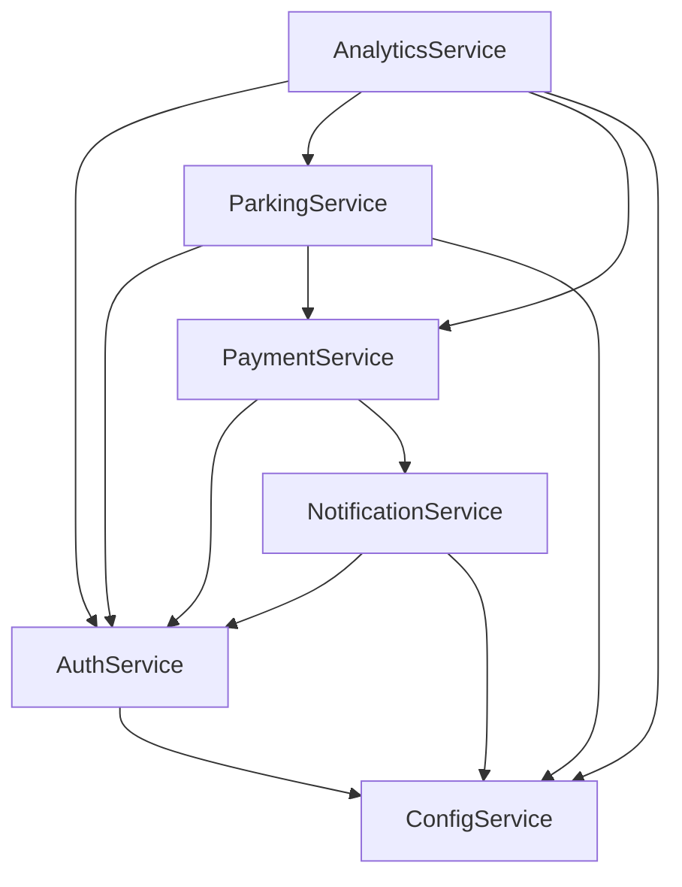

# Microservices Boundaries & Service Responsibilities

## Overview

This document defines the precise boundaries, responsibilities, and contracts for each microservice in the parking management platform. The design follows Domain-Driven Design (DDD) principles with clear bounded contexts and minimal coupling between services.

## Service Boundary Matrix

### 1. Authentication & Authorization Service (AuthService)

**Domain Boundary**: User identity, role management, session handling
**Primary Responsibility**: Secure user authentication and authorization

**Core Capabilities**:
- User registration, login, password management
- Role-based access control (RBAC) with hierarchical permissions
- JWT token management with refresh token rotation
- Multi-factor authentication (MFA) support
- Session management across distributed services
- OAuth2/OIDC integration for enterprise SSO
- Audit logging for security events

**API Contracts**:
```typescript
interface AuthService {
  // Authentication
  POST /auth/login: { email: string, password: string } → { accessToken: string, refreshToken: string, user: User }
  POST /auth/register: { email: string, password: string, role: string } → { user: User }
  POST /auth/refresh: { refreshToken: string } → { accessToken: string, refreshToken: string }
  POST /auth/logout: { refreshToken: string } → { success: boolean }
  
  // Authorization
  GET /auth/permissions/{userId}: → { permissions: Permission[] }
  POST /auth/validate-token: { token: string } → { valid: boolean, user: User, permissions: Permission[] }
  
  // User Management
  GET /users: → { users: User[], pagination: PaginationInfo }
  PUT /users/{id}: { user: Partial<User> } → { user: User }
  DELETE /users/{id}: → { success: boolean }
}

interface User {
  id: string
  email: string
  role: 'admin' | 'operator' | 'viewer'
  locationAccess: string[]
  permissions: Permission[]
  lastLogin: string
  isActive: boolean
  profile: UserProfile
}
```

**Database Schema**:
- Primary: `users`, `roles`, `permissions`, `sessions`, `audit_log`
- Shared: Location IDs for access control

**Events Published**:
- `UserAuthenticated`, `UserLoggedOut`, `UserRegistered`, `PermissionsChanged`

**Events Consumed**:
- `LocationCreated`, `LocationDeactivated` (for access control updates)

### 2. Parking Operations Service (ParkingService)

**Domain Boundary**: Vehicle entries, exits, parking space management
**Primary Responsibility**: Core parking business logic and operations

**Core Capabilities**:
- Vehicle entry registration with validation
- Vehicle exit processing with fee calculation
- Parking space allocation and tracking
- Vehicle search and status management
- Entry/exit workflow orchestration
- Business rule enforcement (overstay, duplicate prevention)
- Real-time occupancy tracking

**API Contracts**:
```typescript
interface ParkingService {
  // Entry Management
  POST /parking/entries: { entry: CreateEntryRequest } → { entry: ParkingEntry }
  GET /parking/entries: { filters?: SearchFilters, pagination?: PaginationRequest } → { entries: ParkingEntry[], pagination: PaginationInfo }
  GET /parking/entries/{id}: → { entry: ParkingEntry }
  PUT /parking/entries/{id}: { updates: Partial<ParkingEntry> } → { entry: ParkingEntry }
  DELETE /parking/entries/{id}: → { success: boolean }
  
  // Exit Processing
  POST /parking/exits: { vehicleNumber: string, exitData: ExitRequest } → { entry: ParkingEntry, fee: FeeCalculation }
  
  // Search & Analytics
  GET /parking/search: { query: string, filters: SearchFilters } → { results: SearchResult[] }
  GET /parking/occupancy/{locationId}: → { occupancy: OccupancyInfo }
  GET /parking/overstays/{locationId}: → { vehicles: ParkingEntry[] }
}

interface ParkingEntry {
  id: string
  serial: number
  transportName: string
  vehicleType: VehicleType
  vehicleNumber: string
  driverName: string
  driverPhone: string
  notes: string
  entryTime: string
  exitTime: string | null
  status: 'Parked' | 'Exited'
  locationId: string
  spaceNumber?: string
  createdBy: string
  lastModified: string
}

interface FeeCalculation {
  baseFee: number
  overstayFee: number
  totalFee: number
  duration: {
    hours: number
    days: number
  }
  rate: number
}
```

**Database Schema**:
- Primary: `parking_entries`, `parking_spaces`, `location_settings`
- Shared: Location IDs, user IDs for audit

**Events Published**:
- `VehicleEntered`, `VehicleExited`, `VehicleOverstayed`, `SpaceOccupied`, `SpaceReleased`

**Events Consumed**:
- `PaymentProcessed`, `PaymentFailed` (for status updates)
- `LocationSettingsChanged` (for rate updates)

### 3. Payment & Billing Service (PaymentService)

**Domain Boundary**: Payment processing, fee calculation, financial transactions
**Primary Responsibility**: All payment-related operations and billing

**Core Capabilities**:
- Fee calculation with complex business rules
- Payment processing with multiple payment methods
- Payment status tracking and reconciliation
- Refund processing and dispute management
- Financial reporting and transaction history
- Integration with payment gateways (Stripe, PayPal, etc.)
- Automated invoicing and receipts

**API Contracts**:
```typescript
interface PaymentService {
  // Fee Calculation
  POST /payments/calculate-fee: { entryId: string, exitTime?: string } → { calculation: FeeCalculation }
  
  // Payment Processing
  POST /payments/process: { entryId: string, paymentMethod: PaymentMethod, amount: number } → { payment: Payment }
  GET /payments/{id}: → { payment: Payment }
  GET /payments/entry/{entryId}: → { payments: Payment[] }
  
  // Refunds & Disputes
  POST /payments/{id}/refund: { amount?: number, reason: string } → { refund: Refund }
  POST /payments/{id}/dispute: { reason: string } → { dispute: Dispute }
  
  // Financial Reports
  GET /payments/reports/revenue: { dateRange: DateRange, locationId?: string } → { report: RevenueReport }
  GET /payments/reports/transactions: { filters: TransactionFilters } → { transactions: Transaction[] }
}

interface Payment {
  id: string
  entryId: string
  amount: number
  paymentMethod: 'Cash' | 'Credit Card' | 'Debit Card' | 'UPI' | 'Online'
  status: 'Paid' | 'Unpaid' | 'Pending' | 'Refunded' | 'Disputed'
  transactionId: string
  gatewayResponse: any
  processedAt: string
  refunds: Refund[]
}

interface RevenueReport {
  totalRevenue: number
  transactionCount: number
  averageTransaction: number
  revenueByMethod: Record<string, number>
  revenueByVehicleType: Record<string, number>
  dailyBreakdown: DailyRevenue[]
}
```

**Database Schema**:
- Primary: `payments`, `transactions`, `refunds`, `disputes`, `fee_calculations`
- Shared: Entry IDs, location IDs

**Events Published**:
- `PaymentProcessed`, `PaymentFailed`, `RefundProcessed`, `DisputeCreated`

**Events Consumed**:
- `VehicleExited` (for automatic fee calculation)
- `EntryUpdated` (for fee recalculation)

### 4. Notification Service (NotificationService)

**Domain Boundary**: Multi-channel communication and alerts
**Primary Responsibility**: Notification delivery and communication management

**Core Capabilities**:
- Multi-channel notifications (email, SMS, push, in-app)
- Template-based messaging with localization
- Real-time alerts for business events
- Notification preferences and scheduling
- Delivery tracking and retry logic
- Integration with email/SMS providers
- Automated notification workflows

**API Contracts**:
```typescript
interface NotificationService {
  // Send Notifications
  POST /notifications/send: { notification: NotificationRequest } → { notification: Notification }
  POST /notifications/broadcast: { notification: BroadcastRequest } → { notifications: Notification[] }
  
  // Templates & Preferences
  GET /notifications/templates: → { templates: NotificationTemplate[] }
  POST /notifications/templates: { template: CreateTemplateRequest } → { template: NotificationTemplate }
  GET /notifications/preferences/{userId}: → { preferences: NotificationPreferences }
  PUT /notifications/preferences/{userId}: { preferences: NotificationPreferences } → { preferences: NotificationPreferences }
  
  // Delivery Tracking
  GET /notifications/{id}: → { notification: Notification }
  GET /notifications/history/{userId}: → { notifications: Notification[] }
}

interface NotificationRequest {
  recipientId: string
  channel: 'email' | 'sms' | 'push' | 'in-app'
  templateId: string
  data: Record<string, any>
  priority: 'low' | 'medium' | 'high' | 'urgent'
  scheduledAt?: string
}

interface Notification {
  id: string
  recipientId: string
  channel: string
  subject: string
  content: string
  status: 'pending' | 'sent' | 'delivered' | 'failed'
  sentAt: string
  deliveredAt?: string
  failureReason?: string
}
```

**Database Schema**:
- Primary: `notifications`, `notification_templates`, `notification_preferences`, `delivery_log`

**Events Published**:
- `NotificationSent`, `NotificationDelivered`, `NotificationFailed`

**Events Consumed**:
- `VehicleOverstayed`, `PaymentFailed`, `UserRegistered`, `VehicleExited` (for automated notifications)

### 5. Analytics & Reporting Service (AnalyticsService)

**Domain Boundary**: Data analytics, reporting, and business intelligence
**Primary Responsibility**: Advanced analytics and comprehensive reporting

**Core Capabilities**:
- Real-time analytics and KPI calculation
- Historical trend analysis and forecasting
- Custom report generation with scheduling
- Data aggregation and statistical analysis
- Performance monitoring and optimization insights
- Interactive dashboard data provisioning
- Export capabilities (PDF, Excel, CSV)

**API Contracts**:
```typescript
interface AnalyticsService {
  // Real-time Analytics
  GET /analytics/dashboard/{locationId}: → { dashboard: DashboardData }
  GET /analytics/kpis: { dateRange: DateRange, locationId?: string } → { kpis: KPIReport }
  
  // Historical Analysis
  GET /analytics/trends: { metric: string, dateRange: DateRange, granularity: 'hour' | 'day' | 'week' | 'month' } → { trends: TrendData[] }
  GET /analytics/forecast: { metric: string, days: number } → { forecast: ForecastData }
  
  // Custom Reports
  POST /analytics/reports: { reportConfig: ReportConfiguration } → { report: Report }
  GET /analytics/reports/{id}: → { report: Report }
  GET /analytics/reports: → { reports: ReportSummary[] }
  
  // Data Export
  POST /analytics/export: { format: 'pdf' | 'excel' | 'csv', reportId: string } → { downloadUrl: string }
}

interface DashboardData {
  currentOccupancy: OccupancyMetrics
  todayStats: DailyStats
  revenueMetrics: RevenueMetrics
  performanceIndicators: PerformanceMetrics
  alerts: Alert[]
  recentActivity: ActivitySummary[]
}

interface KPIReport {
  occupancyRate: number
  averageStayDuration: number
  revenuePerSpace: number
  customerSatisfaction: number
  operationalEfficiency: number
  peakUtilizationTime: string
}
```

**Database Schema**:
- Primary: `analytics_cache`, `reports`, `kpi_history`, `forecast_data`
- Read replicas: All operational data for analysis

**Events Published**:
- `ReportGenerated`, `AlertTriggered`, `KPIThresholdExceeded`

**Events Consumed**:
- All events from other services for real-time analytics updates

### 6. Configuration Service (ConfigService)

**Domain Boundary**: System configuration, business rules, multi-tenancy
**Primary Responsibility**: Centralized configuration and tenant management

**Core Capabilities**:
- Multi-tenant configuration management
- Business rule engine with dynamic updates
- Feature flag management and A/B testing
- Location-specific settings and customization
- System-wide configuration distribution
- Configuration versioning and rollback
- Environment-specific configurations

**API Contracts**:
```typescript
interface ConfigService {
  // Configuration Management
  GET /config/tenant/{tenantId}: → { config: TenantConfiguration }
  PUT /config/tenant/{tenantId}: { config: Partial<TenantConfiguration> } → { config: TenantConfiguration }
  GET /config/location/{locationId}: → { config: LocationConfiguration }
  PUT /config/location/{locationId}: { config: Partial<LocationConfiguration> } → { config: LocationConfiguration }
  
  // Business Rules
  GET /config/rules/{domain}: → { rules: BusinessRule[] }
  POST /config/rules: { rule: CreateRuleRequest } → { rule: BusinessRule }
  PUT /config/rules/{id}: { rule: Partial<BusinessRule> } → { rule: BusinessRule }
  
  // Feature Flags
  GET /config/features/{tenantId}: → { features: FeatureFlag[] }
  POST /config/features: { feature: CreateFeatureFlagRequest } → { feature: FeatureFlag }
}

interface TenantConfiguration {
  tenantId: string
  name: string
  settings: {
    theme: ThemeConfiguration
    billing: BillingConfiguration
    notifications: NotificationConfiguration
    features: Record<string, boolean>
  }
  locations: LocationConfiguration[]
  customizations: Record<string, any>
}

interface LocationConfiguration {
  locationId: string
  name: string
  address: string
  capacity: number
  rates: VehicleRates
  businessHours: BusinessHours
  rules: BusinessRule[]
  integrations: IntegrationSettings
}
```

**Database Schema**:
- Primary: `tenant_config`, `location_config`, `business_rules`, `feature_flags`, `config_history`

**Events Published**:
- `ConfigurationChanged`, `BusinessRuleUpdated`, `FeatureFlagToggled`

**Events Consumed**:
- `LocationCreated`, `TenantCreated` (for initial configuration)

## Inter-Service Communication Patterns

### Synchronous Communication (REST APIs)

**Use Cases**: Real-time queries, immediate responses required
- User authentication validation
- Fee calculation requests
- Configuration lookups
- Direct data retrieval

**Pattern**: Request-Response with timeout handling and circuit breakers

### Asynchronous Communication (Event Streaming)

**Use Cases**: Business events, data synchronization, workflow triggers
- Vehicle entry/exit events
- Payment processing events
- Configuration changes
- Notification triggers

**Pattern**: Event-driven architecture using Apache Kafka or AWS EventBridge

### Event Schema Standards

```typescript
interface BaseEvent {
  eventId: string
  eventType: string
  source: string
  timestamp: string
  version: string
  correlationId?: string
  tenantId: string
  locationId?: string
}

interface VehicleEnteredEvent extends BaseEvent {
  eventType: 'VehicleEntered'
  data: {
    entryId: string
    vehicleNumber: string
    vehicleType: string
    entryTime: string
    locationId: string
    spaceNumber?: string
  }
}
```

## Data Consistency Patterns

### Eventual Consistency

**Services**: Analytics, Notifications, Reporting
**Pattern**: Accept temporary inconsistency for better performance
**Implementation**: Event-driven updates with conflict resolution

### Strong Consistency

**Services**: Payments, Authentication, Core Parking Operations
**Pattern**: ACID transactions within service boundaries
**Implementation**: Database transactions with two-phase commit for cross-service operations

### Saga Pattern

**Use Case**: Complex workflows spanning multiple services (vehicle exit + payment + notification)
**Implementation**: Choreography-based sagas with compensating transactions

## Service Dependencies

### Dependency Graph



### Circular Dependency Prevention

- **Configuration Service** is foundational (no dependencies on other business services)
- **Authentication Service** depends only on Configuration Service
- **Notification Service** consumes events but doesn't create circular dependencies
- **Analytics Service** is read-only from other services' perspectives

## Security Boundaries

### Authentication & Authorization

- JWT tokens validated at API Gateway level
- Service-to-service communication uses mutual TLS
- Each service validates permissions for domain-specific operations
- Audit logging at service boundaries

### Data Privacy

- PII data encrypted at rest and in transit
- Role-based access control enforced at service level
- Data anonymization for analytics and reporting
- GDPR compliance with data deletion workflows

## Monitoring & Observability

### Health Checks

Each service exposes standardized health endpoints:
- `/health/live` - Liveness probe
- `/health/ready` - Readiness probe  
- `/health/metrics` - Prometheus metrics
- `/health/info` - Service information

### Distributed Tracing

- OpenTelemetry integration across all services
- Correlation IDs propagated through request chains
- Performance monitoring with Jaeger or Zipkin

### Logging Standards

```json
{
  "timestamp": "2024-01-20T10:30:00Z",
  "level": "INFO",
  "service": "parking-service",
  "traceId": "abc123",
  "message": "Vehicle entered",
  "data": {
    "entryId": "entry-456",
    "vehicleNumber": "ABC-123"
  }
}
```

This microservices boundary design provides clear separation of concerns while maintaining efficient communication patterns and strong consistency where needed.